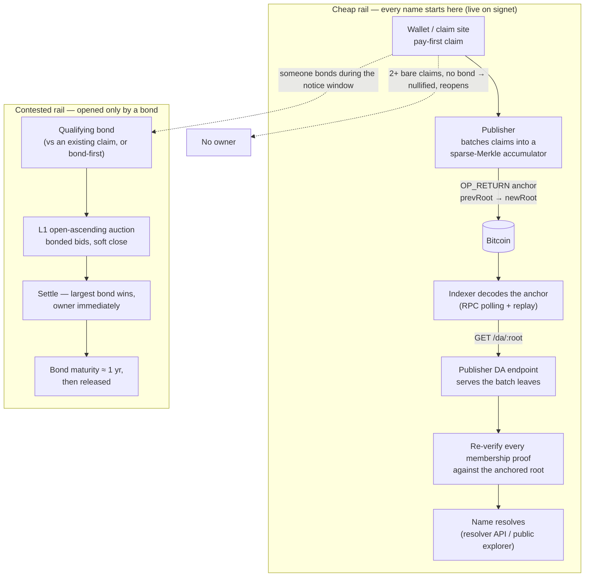

# Open Name Tags (ONT) — the system as built

This page is one layer below the **[one-pager](./docs/ONT_ONE_PAGER.md)** — read that first; this
README assumes it. Here we cover how the two rails actually run end to end, where each rule is
enforced, what the three service roles do operationally, how to audit the trust surface yourself,
and what evidence would falsify our claims.

> **Status: prototype on a private Bitcoin signet — not mainnet-ready.** The canonical record of
> what is live vs. prototype vs. designed, and of every number, is
> **[docs/core/STATUS.md](./docs/core/STATUS.md)**. If anything on this page disagrees with that
> file, that file wins. Amounts are written as **₿ where ₿1 = 1 satoshi**; `~$` helpers assume
> ~$100,000/BTC and drift with the price.

## Where this page sits

The docs are layered, shallow to deep. Each layer defers upward for "what is ONT" and downward for
detail:

1. **[ONT.md](./docs/ONT.md)** — the plain-language source of truth
2. **[One-pager](./docs/ONT_ONE_PAGER.md)** — the reviewer's summary (assumed read)
3. **This README** — the system as built
4. **[Design brief](./docs/ONT_DESIGN_BRIEF.md)** — the full design: model, trust surface,
   scaling and data availability, economics, prior art, risks
5. **[docs/design/](./docs/design/)** — per-mechanism references: the
   [acquisition state machine](./docs/spec/ONT_ACQUISITION_STATE_MACHINE.md),
   [data-availability agreement](./docs/spec/ONT_DATA_AVAILABILITY_AGREEMENT.md),
   [MEV/ordering analysis](./docs/design/ONT_MEV_ORDERING_ANALYSIS.md),
   [sovereignty map](./docs/design/ONT_SOVEREIGNTY_MAP.md),
   [risk register](./docs/design/ONT_RISK_REGISTER.md)
6. **The code** — `packages/{protocol,consensus,core}/src` — for claims about code, code wins

Two cross-cutting files: **[DECISIONS.md](./docs/core/DECISIONS.md)** is the numbered decision
log (a numbered decision supersedes any analysis note that predates it), and
**[STATUS.md](./docs/core/STATUS.md)** is the canonical status and numbers. `docs/research/` is
analysis — kept current with decisions, but check dates.

## The 30-minute review path

If you want to evaluate rather than browse:

1. **Read the lifecycle (~10 min):**
   [the acquisition state machine](./docs/spec/ONT_ACQUISITION_STATE_MACHINE.md). The points
   that matter beyond the one-pager's flow: a **bond — not a bare claim — opens the auction**
   (Decision #37); two bare claims with no bond **nullify** (deny, never award — so block
   ordering, even a miner's own, can't be converted into a name); **bond-first** is allowed for
   known-premium names, and the ≤4-character opening bonds are the mandatory case of the same
   mechanism; both outcomes are **deadline-derived** — a verifier observes chain state at the
   window's closing height and applies fixed rules.
2. **Audit the trust surface (~10 min):** the three files in `packages/consensus/src/` — see
   [The trust surface](#the-trust-surface-and-auditing-it-yourself) below.
3. **Run the tests (~5 min):** the commands in the same section — including the CI lock that
   fails the build if the audited surface grows.
4. **Watch the live loop (~5 min):** claim a throwaway name at
   [claim.opennametags.org](https://claim.opennametags.org) and watch it appear in the
   [explorer](https://opennametags.org/explore) once the anchor confirms on the signet.

## Architecture: the two rails, end to end

Both rails end the same way — a name bound to one **owner key** — and a verifier derives both from
Bitcoin, not from any server's say-so.



**The cheap rail** (live on signet end-to-end since 2026-06-09):

1. **Claim, pay-first.** The claim site or wallet requests a quote, pays the publisher (Lightning
   on mainnet; stubbed on signet), and submits the name + intended owner key. A non-payer is
   simply left out — the publisher fronts no capital (Decision #38).
2. **Batch.** The publisher applies paid claims as deltas to a sparse-Merkle accumulator and seals
   a batch when a size or age threshold is hit.
3. **Anchor.** One OP_RETURN carrying `prevRoot → newRoot` is broadcast. The batch is now
   Bitcoin-ordered.
4. **Decode.** The resolver's indexer, polling Bitcoin over RPC, decodes the anchor. The root is
   known but unresolved — a root alone proves nothing about which names are inside.
5. **Fetch the data.** The resolver fetches the batch leaves from the publisher's `/da/{root}`
   endpoint (content-addressed by the anchored digest; mirrorable by anyone — Decision #39).
6. **Re-verify.** Every leaf's membership proof is re-checked against the on-chain root before
   merging. Bytes that don't verify are discarded — a lying or compromised data source can't mint
   ownership. Transport is verify-don't-trust, so it is not consensus-critical and stays swappable.
7. **Resolve.** The name resolves and appears in the public explorer.

What the live loop does **not** yet enforce (disclosed in STATUS): the **fail-closed availability
deadline** — "batch bytes not public by a Bitcoin-height-keyed deadline don't count." The
`AvailabilityMarker` event is wire-defined and tested but never emitted in production, and the
W/C/K windows run only in research simulations. Today, missing bytes are simply retried with
backoff — fine for an honest single publisher on signet, but the withhold-then-reveal defense for
contested names depends on the deadline rule.

**The contested rail** (a bonded bid runs end-to-end on signet):

1. **A qualifying bond opens the auction** (Decision #37) — posted against an existing claim
   during its notice window, or *bond-first* with no prior claim (the natural path for a
   known-premium name; the ≤4-character length-scaled opening bonds are the mandatory bond-first
   case of the same mechanism).
2. **Open ascending auction** on L1: visible bonded bid transactions, soft close, objective
   minimum increments (Decision #35).
3. **Settle.** Largest bond wins; the winner owns and can use the name immediately.
4. **Maturity.** The winning bond stays posted (≈1 year target — an ONT rule, not a Bitcoin
   timelock: break it early and you forfeit the name), then releases.

A bare second claim never enters this rail: two or more cheap claims with no bond **nullify** the
name — no owner, reopens for claiming. Collisions can deny; only bonds can award.

**Two keys, one secret.** The *wallet key* signs the Bitcoin transactions (claims, bonds,
anchors); the *owner key* signs off-chain value records, transfers, and recovery. Since Decision
#41 both derive from a single 12-word phrase, identically across the claim site, web tools, and
mobile app — locked by shared conformance vectors.

### Where each rule is enforced

| Rule | Lives in | Boundary |
| --- | --- | --- |
| Owner-key authority: transfers, value records, recovery — replay validation | `packages/consensus/src/engine.ts`, `state.ts` | **Frozen consensus core** (CI-locked) |
| Portable proofs: structure + Merkle-inclusion/header-PoW vs Bitcoin | `packages/consensus/src/proof-bundle.ts` | **Frozen consensus core** |
| Names, wire formats, events, payload signatures | `packages/protocol/src/` | Protocol primitives |
| Anchor decode, accumulator membership verification, batch merge | `packages/core/src/indexer.ts`, `root-anchor.ts`, `accumulator.ts` | Canonical indexer (outside the frozen core) |
| Auction settlement — winner becomes owner | `packages/core/src/experimental-auction.ts` | **Outside the frozen core today** — see below |
| Notice-window outcomes (finalize / nullify / bond-escalate) + DA windows | `packages/core/src/research/batch-rail.ts` + simulations | Design + simulation only |
| Value/recovery record acceptance, chain ordering per ownership interval | `apps/resolver/src/validation.ts` | Resolver policy |
| DA fetch, retry/backoff, snapshot persistence | `apps/resolver`, `apps/indexer` | Operational |
| Quotes, payment, batching thresholds, anchor broadcast | `apps/publisher` | Operational — no ownership authority |

**The honest boundary, stated plainly.** The frozen core determines owner-key authority and
replay validation. **Auction settlement → ownership currently lives outside it**, in experimental
indexer code: `applyAuctionBid` validates and records bids, but deciding winner-becomes-owner is
not yet inside the audited boundary. Decision #42: settlement **will move inside the frozen
core, gated on demonstrated correctness** — until that lands, we do not claim "the three frozen
files alone determine all ownership." And nothing is "frozen" in the Bitcoin sense yet: launch
parameters are placeholders until they're frozen and published before launch (see STATUS).

## The three roles, operationally

### Publisher — write side (`apps/publisher`; live on signet, single-writer)

- **Pay-first.** Quote → payment → inclusion. A claim enters the pending set only after payment
  clears; the publisher's exposure is bounded structurally, the user's is ~₿1,000 (~$1).
- **Batching.** A batch seals when pending paid claims reach `maxBatchSize` **or** the oldest
  pending claim exceeds `maxBatchAgeSeconds` (the signet demo anchors instantly with size 1; real
  batching is the same code with bigger thresholds).
- **Anchor broadcast.** Real OP_RETURN broadcast on signet.
- **DA serving.** `GET /da/{root}` returns the sealed batch's leaves for any anchored root.
- **What a restart must survive.** The publisher snapshots quotes, pending paid claims, and batch
  history (`ONT_PUBLISHER_STORE_PATH`). On restore it replays batches in order and rebuilds each
  DA bundle at exactly the accumulator state where that batch's `newRoot` was captured — without
  this, a restart would 404 `/da/{root}` for every prior batch and strand any indexer that hadn't
  synced yet.
- **Known limits.** Lightning is stubbed on signet (the LN provider is mainnet-only); leaderless
  multi-publisher convergence is
  [simulated and tested](./docs/research/ONT_MULTI_PUBLISHER_CONVERGENCE.md), not deployed.

### Resolver — read side (`apps/resolver` + `apps/indexer`; live on signet)

- **Source.** Fixture, Bitcoin RPC, or esplora (`ONT_SOURCE_MODE`), pinned to an expected chain.
  Polls for new blocks (default every 10s) and replays each block's ONT events through the indexer
  and consensus engine — ownership is recomputed, never asserted.
- **Snapshot persistence.** Indexer state persists to a file or Postgres (via `@ont/db`); a
  restart resumes from the snapshot instead of re-scanning the chain.
- **Cheap-rail DA loop.** For every observed-but-unresolved anchor root, fetch `/da/{root}` and
  merge only the leaves whose proofs verify against the on-chain root, with per-root exponential
  backoff (1×, 2×, 4×… the poll interval, capped at 30 minutes) so a missing batch can't make the
  resolver hammer the publisher.
- **Record serving.** Value records and recovery artifacts are owner-signed, sequence-numbered,
  predecessor-linked chains **keyed by ownership interval** — an L1 name's interval by its current
  state txid, a cheap-rail name's by its finalizing anchor txid. A new owner starts a fresh chain,
  and stale records from a prior owner are rejected (`apps/resolver/src/validation.ts`). The
  resolver stores and serves records; it cannot invent them — a forged record fails owner-signature
  verification at every client.

### Watchtower — designed, not built

Recovery is opt-in (a name with no recovery descriptor is one key, cold-storage style). If armed,
the challenge-window veto should not require the owner to be online: the target shape is a
non-custodial watcher holding a **name-scoped, abort-only credential** — it can cancel a malicious
recovery, never move the name (Decision #40). The credential construction is an open design
problem, raised for external feedback
([ONT_LONG_TAIL_RECOVERY.md §5.6](./docs/research/archive/ONT_LONG_TAIL_RECOVERY.md)).

## The trust surface, and auditing it yourself

- **The frozen core is three files** — `engine.ts`, `state.ts`, `proof-bundle.ts` in
  `packages/consensus/src/` — over the `@ont/protocol` + `@ont/bitcoin` primitives.
  `packages/consensus/src/trust-surface.test.ts` **fails the build** if the core grows a
  dependency or file outside its documented allowed set, so the surface a newcomer must audit
  cannot silently grow.
- **Proof bundles have two explicit levels**: `verifyProofBundleStructure` (internal consistency
  only — "well-formed," not "settled on Bitcoin") and `verifyProofBundleAgainstBitcoin` (Merkle
  inclusion + header proof-of-work, unit-tested against a real mainnet block with tamper tests).
  Producers don't emit the `bitcoinInclusion` section yet, so the light-client path is not closed
  end-to-end.
- **Conformance vectors** (`packages/protocol/testdata/conformance-vectors.json`) lock the
  12-word-phrase key derivation and signatures across all four implementations — engine, web,
  claim site, mobile.
- **Neutrality is mechanically checkable**: the name grammar is `[a-z0-9]{1,32}`
  (`packages/protocol/src/constants.ts`) with **no reserved set** — every award path is mechanical.

```bash
npm install
npm run test -w @ont/consensus   # trust-surface lock + proof bundles (incl. Bitcoin Merkle/PoW)
npm run test -w @ont/protocol    # wire formats, payloads, conformance vectors
npm run test -w @ont/core        # indexer, accumulator, auction state, research quarantine
npm run test -w @ont/publisher   # pay-first flow + the cheap-rail loop test (publisher bytes → indexer decode)
```

## What would falsify our claims

Five invariants are treated as inviolable; everything else (parameters, auction form, UX) is
negotiable. For each: what evidence would break it, and where we are still exposed today.

- **Sovereign** — one-time cost; afterwards no rent, renewal, expiry, or revocation; only the
  owner key moves a name.
  *Broken by:* any code path that transfers or revokes a name without the current owner key's
  signature, or any recurring-payment rule. Check `engine.ts` replay rules and the
  [sovereignty map](./docs/design/ONT_SOVEREIGNTY_MAP.md).
  *Exposure:* an armed recovery depends on a challenge-window veto; delegating that veto to a
  non-custodial watcher needs the abort-only credential that doesn't exist yet. Pre-maturity,
  spending a winning bond forfeits the name — a disclosed rule the owner opts into, not a
  revocation by anyone.
- **Neutral** — no registrar, allocator, or discretionary path, explicitly including the founder.
  *Broken by:* a reserved list, founder allocation, admin key, or any judgment call in the award
  path. Check the name grammar and the state machine — every award is mechanical.
  *Exposure:* launch fairness is open (risk register R7 — keeping a day-one rush competitive).
  And the bond floor (placeholder ₿50,000, ~$50) is honestly **asymmetric**: it deters frivolous
  escalation, but capital wins contested names by design. We accept and document that asymmetry
  rather than patch it — no sponsorship or proxy-bonding tooling, in v1 or as a protocol
  direction (Decision #43); third-party bonding stays permissionless, and defense capital is a
  loan arranged outside the protocol.
- **Verifiable without trust** — a fresh verifier reconstructs why a name is owned from public
  data plus Bitcoin, trusting no server.
  *Broken by:* any answer a client must accept but cannot check.
  *Exposure:* producers don't yet emit the `bitcoinInclusion` section, so the phone/light-client
  path isn't closed — a phone today trusts the resolver it queries. And an auction proof bundle
  enforces highest-listed-bid-wins and a well-formed bid set, but does not prove the listed set is
  the **complete** set of L1 bids; closing set-completeness is the same light-client work.
- **Censorship-resistant** — no operator can permanently prevent acquiring or resolving a name.
  *Broken by:* a chokepoint with no route around it. The backstops: direct L1 claiming is always
  available, any resolver is replaceable, and verification catches a lying one.
  *Exposure:* the live publisher is single-writer; discovery is config-seeded; and the
  **fail-closed DA deadline is the sharpest open item** — until it's implemented, the
  withhold-then-reveal defense for contested names is not operational. On denial-by-collision: a
  spite griefer can nullify a targeted name for ₿1,000 per round, with no payoff; the
  [attrition model](./docs/research/archive/ONT_NULLIFICATION_ATTRITION_MODEL.md) shows one qualifying
  bond ends the denial loop, with the attacker's sunk cost exceeding the defender's carry at
  every window phase.
- **Unambiguous** — two honest observers never disagree about a name's owner.
  *Broken by:* two honest verifiers computing different owners from the same chain. The mechanism
  is deterministic replay, with conflicts resolved by block height, then tx index, then txid.
  *Exposure:* until the DA deadline is live, "exclude unavailable bytes" is not an enforced
  deterministic rule; and multi-publisher convergence is proven in simulation only.

## What's live vs. prototype vs. designed

**Canonical table: [docs/core/STATUS.md](./docs/core/STATUS.md)** — that file is the source of
truth and wins over this summary.

| Status | Summary |
| --- | --- |
| **Live (signet)** | Owner-key transfer / value records / recovery; bonded auction bid resolver-accepted; the **accumulator cheap rail end-to-end since 2026-06-09** (claim → anchor → DA fetch → re-verify → public explorer); single-writer publisher with restart-surviving DA bundles; bare-claim site; unified 12-word secret across all surfaces |
| **Prototype** | Bitcoin-inclusion verifier (tested vs a real mainnet block; producers don't emit proofs); mobile iOS app (walkable signet demo) |
| **Designed** | Registry-free discovery; the watchtower; the fail-closed DA deadline (W/C/K); leaderless multi-publisher deployment |

## The numbers

**Canonical numbers: [docs/core/STATUS.md](./docs/core/STATUS.md).** Summary: the claim gate is
**₿1,000** (~$1), sunk, paid to Bitcoin's miners — the decided baseline. Everything else is a
**placeholder pending launch freeze**: contested-auction minimum bond ₿50,000 (~$50, returnable),
bond maturity ≈52,560 blocks (≈1 yr), notice window 6 blocks in tests with a target of weeks, and
a publisher service fee TBD (the ₿200 signet value is a placeholder, likely too high). Two
measured facts, not parameters: ONT events are single OP_RETURNs up to ~171 bytes (above the
80-byte default relay policy — an open mainnet question), and issuance costs
~0.015–0.019 vB/name amortized at ~10k claims per batch. Every consensus-affecting parameter must
be frozen and published before launch; until then, nothing here should be called "frozen."

## Adversarial posture (post-Decision #37)

- **Ordering buys nothing.** Front-running a cheap claim — even a miner ordering its own claim
  first in a block it mines — at worst *nullifies* the name: denial, no payoff. Acquiring a
  contested name requires a returnable bond, identical cost for a miner and anyone else.
- **Collision denies, never awards.** A spite-griefer can nullify a targeted name for ₿1,000
  per round, all sunk.
- **One qualifying bond ends the denial loop.** The
  [nullification-attrition model](./docs/research/archive/ONT_NULLIFICATION_ATTRITION_MODEL.md): once the
  defender posts a bond, the name goes to auction and settles — re-colliding stops working — and
  at a 5%/yr opportunity-cost assumption the attacker's cumulative sunk cost exceeds the
  defender's carry at every phase of the window schedule.
- **The bond-floor asymmetry is accepted, not hidden** (Decision #43): defending takes ₿50,000 of
  returnable capital while attacking burns ₿1,000 sunk per round. We document it honestly and
  ship no sponsorship or proxy-bonding tooling, in v1 or as a protocol direction — third-party
  bonding is already permissionless (anyone can post a bond on any name), and a loan is arranged
  outside the protocol.
- **Known-incomplete, disclosed** (details in STATUS): the fail-closed DA deadline isn't live, so
  the withhold-then-reveal defense isn't operational; light-client inclusion proofs aren't emitted
  end-to-end; and auction proof bundles enforce highest-listed-bid-wins and bid-set
  well-formedness but not *set-completeness* against L1 — closing that is the same light-client
  work.

## Run it yourself

```bash
# local prototype (bundled fixture chain)
npm install
npm run dev:all          # http://127.0.0.1:3000

# your own web + resolver stack
cp .env.example .env
npm run selfhost:doctor
npm run selfhost:up      # http://127.0.0.1:3000
```

To point the stack at your own Bitcoin backend, see
[SELF_HOSTING.md](./docs/operate/SELF_HOSTING.md). The hosted signet demo exercises the cheap rail
live: claim a name at [claim.opennametags.org](https://claim.opennametags.org) (keys generated in
your browser; the page runs offline for key generation) and watch it appear in the
[explorer](https://opennametags.org/explore) once the anchor confirms. Walkthroughs:
[Sparrow private-signet](./docs/operate/demo/SPARROW_PRIVATE_SIGNET.md) ·
[Flint demo](./docs/operate/demo/FLINT_DEMO.md).

## Repository map

TypeScript monorepo (`npm` workspaces). **Audit-first:** `packages/consensus` (engine · state ·
proof-bundle — the frozen core) + `packages/protocol` (names · wire · events · payloads).

- `packages/bitcoin` — Bitcoin RPC/esplora pollers, parsing, chain-source helpers
- `packages/core` — canonical indexer, accumulator, auction state, and the quarantined research/simulation code
- `packages/architect` — transaction-prep / PSBT building (shared by web + CLI)
- `packages/db` — snapshot + record persistence adapters (file / Postgres)
- `apps/publisher` — the cheap-rail publisher: quotes, pay-first batching, anchor broadcast, `/da/{root}`
- `apps/resolver` — read API: ownership, value/recovery records, provenance, the DA loop
- `apps/indexer` — standalone chain-indexing entrypoint
- `apps/claim` — the self-contained bare-claim site (claim.opennametags.org)
- `apps/web` — hosted site: explorer, auctions, transfer prep
- `apps/cli` — auction / transfer / record / operator tooling
- `apps/wallet` — local desktop wallet/client prototype
- `mobile/` — the iOS wallet (Expo / React Native), the second independent implementation

## Where feedback is most valuable

A useful review order: this page → [design brief](./docs/ONT_DESIGN_BRIEF.md) →
[acquisition state machine](./docs/spec/ONT_ACQUISITION_STATE_MACHINE.md) →
[DA agreement](./docs/spec/ONT_DATA_AVAILABILITY_AGREEMENT.md) →
[risk register](./docs/design/ONT_RISK_REGISTER.md). The full ask list is the one-pager's feedback
section plus [OPEN_QUESTIONS_FOR_EXPERTS.md](./docs/research/OPEN_QUESTIONS_FOR_EXPERTS.md); the
sharpest items, in rough order:

1. **The DA deadline and transport** — is fail-closed-by-height sound, and is publisher-served +
   voluntary mirrors enough for v1? Should the availability marker be folded into the anchor?
2. **Light-client verification** — launch blocker, or acceptable post-launch?
3. **The OP_RETURN carrier** — are ~171-byte events acceptable on mainnet?
4. **The bond floor** — it prices escalation *and* defense; the asymmetry above hangs on it.
5. **Notice window length** — the launch-fairness lever; long enough for a competitive early
   market?

Disagreements that stick become numbered entries in [DECISIONS.md](./docs/core/DECISIONS.md).

## License

[MIT](./LICENSE).
