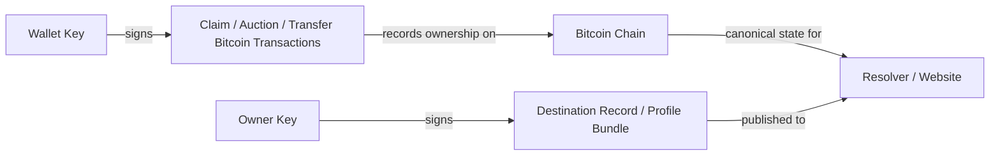

# Open Name Tags (ONT)

Open Name Tags is a payment-handle system anchored to Bitcoin.

An ONT name is a human-readable handle you can actually own. Its first job is simple: let a wallet or client resolve who should get paid before money moves. The owner can update signed off-chain destination records, so the same name can later carry other destinations if clients and applications decide to support them.

> **[docs/ONT.md](./docs/ONT.md) is the single source of truth for the design.** In one line: you
> claim a name for a small fixed amount of bitcoin (≈$1, paid to miners); if no one else wants it,
> it's yours cheaply; if it's contested, it escalates to a bonded auction. The hosted prototype below
> currently implements the bonded-auction path; the cheap long-tail claim path is prototyped and being
> hardened. The detailed sections in this README describe the *running prototype*.

The hosted website is mainly a tool surface:

- browse names
- check ownership and auction state
- inspect eligible names and active auctions
- prepare prototype auction bid packages
- prepare transfers
- fund the private signet demo

This repository is where the fuller project explanation lives.

Human-facing amounts in ONT use ₿ notation. Example: `₿0.0005`.

## Start Here

If you want the shortest honest project orientation before touching the product surface, start with:

1. [docs/ONT.md](./docs/ONT.md) — what ONT is and how it works (the single source of truth)
2. [docs/design/](./docs/design/) — the design reference (sovereignty map, requirements, risks, scaling)
3. [docs/core/ONT_FROM_ZERO.md](./docs/core/ONT_FROM_ZERO.md)
4. [docs/core/NEW_USER_TESTING_GUIDE.md](./docs/core/NEW_USER_TESTING_GUIDE.md)
5. [docs/core/TESTING.md](./docs/core/TESTING.md)

Launch & review working material (current, internal) lives in [docs/launch/](./docs/launch/) — e.g.
`BITCOIN_EXPERT_REVIEW_PACKET`, `ONT_IMPLEMENTATION_AND_VALIDATION`, `UNIVERSAL_AUCTION_LAUNCH_MODEL`,
`LAUNCH_SPEC_V0`, `BITCOIN_REVIEW_CLOSURE_MATRIX`.

If you want the fastest first walkthrough, use the hosted private demo:

1. Open [setup](https://opennametags.org/setup), quit Sparrow if it is open, then run `open /Applications/Sparrow.app --args -n signet` in Terminal. Sparrow chooses Signet when the app starts, not during wallet creation.
2. In Sparrow `Settings` → `Server`, choose `Private Electrum` instead of `Public Server`, then enter the hosted demo host and port shown on setup.
3. Copy a fresh receive address from that Sparrow wallet and request demo coins into it.
4. Open [auctions](https://opennametags.org/auctions), inspect eligible names or active auctions, and prepare a bid package with an owner key.
5. Build and sign the auction bid transaction in Sparrow, then watch the name appear in [explore](https://opennametags.org/explore) after settlement.

If you want the tightest possible product demo instead of the full docs path, use:

- [docs/demo/FLINT_DEMO.md](./docs/demo/FLINT_DEMO.md)

Keep these distinctions in mind:

- the **wallet key** signs Bitcoin transactions
- the **owner key** controls the name later for destination updates and transfers
- the hosted site prepares the flow, but your wallet still signs and broadcasts it
- in v1, losing the **owner key** means losing update and transfer authority for that name

One important testing/status distinction:

- the hosted private demo is a **private signet** walkthrough and the active live environment we maintain
- in the model, uncontested names are claimed cheaply for a small fixed fee; a contested name settles by public bonded auction — and the hosted demo currently exercises that contested/auction path end-to-end
- the old shared **public signet** path has been retired from the active demo and validation story because faucet funding never became reliable

## Quick Map



ONT has two different authority layers:

- the **wallet key** signs Bitcoin transactions that establish or transfer ownership
- the **owner key** signs the off-chain destination record that says what the name points to

## Pick The Path That Fits

There are three practical ways to use ONT today:

| Path | Best for | What you trust | Works today |
| --- | --- | --- | --- |
| `Hosted Private Demo` | Fastest first walkthrough | Hosted site, hosted resolver, private demo chain | Yes |
| `Self-Hosted Website + Resolver` | Running your own browsing and resolution surface | Your own web stack and resolver; optionally your own Bitcoin backend | Yes |
| `Auction Bid Prep` | Reviewing auction state and preparing bidder handoffs | Website preview plus your own wallet signer | Prototype |

Hosted private demo:
- website: [https://opennametags.org](https://opennametags.org)
- setup: [https://opennametags.org/setup](https://opennametags.org/setup)
- auctions + chain-derived bid feed: [https://opennametags.org/auctions](https://opennametags.org/auctions)

Self-hosted website + resolver:
- quick guide: [SELF_HOSTING.md](./docs/core/SELF_HOSTING.md)

## What Works Today

| Capability | Status | Notes |
| --- | --- | --- |
| Hosted private demo auctions | Prototype | Best first walkthrough today |
| Self-hosted website + resolver | Yes | Fixture-backed by default; can point at your own backend later |
| Browser destination publishing | Yes | Owner-signed in the browser |
| Profile bundle destination records | Yes | One record can point to several destinations |
| Transfers | Prototype | Works in the prototype, but not yet mainnet-ready |
| Mainnet-ready usage | Not yet | Still an active prototype |

## Which Key Does What

| Key | What it controls | Used for | If lost |
| --- | --- | --- | --- |
| `Wallet key` | Bitcoin UTXOs | Signing auction bid and transfer transactions | You lose control of the bitcoin and cannot complete those transactions |
| `Owner key` | Name authority after auction settlement | Signing destination updates and authorizing transfers | In v1, you lose update and transfer authority for that name |

## Auction Lifecycle At A Glance

| Phase | What it means | What you do next |
| --- | --- | --- |
| `Review` | Inspect eligibility, current auction state, minimum bid, and closing rules | Decide whether to prepare a bid |
| `Bid Broadcast` | A bid transaction is on-chain with bonded bitcoin | Watch whether the bid becomes or remains the leader |
| `Settling` | The name is already owned and usable, but bond continuity still matters | Keep the bond intact until maturity |
| `Active` | The name is mature, so ongoing bond continuity no longer matters | Publish destinations, update the destination bundle, or transfer later |
| `Released` | The name returned to the pool | Start from the auction flow if you still want it |

## Hosted Demo Walkthrough

If you are brand new, this is the shortest path through the hosted product.

For the shortest presenter-friendly version, use [docs/demo/FLINT_DEMO.md](./docs/demo/FLINT_DEMO.md).

### 1. Start at the homepage

Use the homepage to look up a name, see the quick model, and choose whether you want `Setup`, `Auctions`, or `Explore`.

### 2. Set up Sparrow and request demo coins

Use the setup page to open Sparrow from Terminal with `open /Applications/Sparrow.app --args -n signet`, create or open a wallet, switch Sparrow to `Private Electrum`, confirm it sees the hosted private signet demo chain, then fund the same wallet you plan to spend from.

### 3. Prepare an auction bid

On auctions, inspect the eligible name or active auction, generate or paste the owner key, and build the bid-package signer handoff.

### 4. Publish what the name points to

Once the name is active, use the destinations tool to publish ordered destination entries that describe where the name should resolve.

### 5. Inspect live status

Use the explore page to inspect recent names, provenance, and current live state.

Use the auction page to inspect live auction activity:

- opening bid prep for a searched name
- confirmed auction bids observed by the resolver
- current leaders, next minimum bids, and settled winners

## What ONT Is

ONT names are first-class strings like `alice`.

Ownership is derived from Bitcoin transactions. Mutable destination records stay off-chain and are signed by the current owner key. That means ONT uses Bitcoin as a notary for ownership and state transitions, not as a general-purpose database.

The result is a payment handle that can point to:

- payment endpoints
- additional owner-signed destination records if clients support them later

## Why It Exists

Payment handles are useful because people do not think in raw addresses.

Today, readable payment handles usually depend on a service, account, domain, or operator that sits between the payer and the recipient. That can be a good transitional convenience, but it means the handle's availability and correctness inherit someone else's infrastructure and policies.

ONT is trying to offer a different model:

- no suffixes
- no registrar
- no annual renewal rent
- no protocol operator selling the namespace
- publicly verifiable ownership history

The clearest current wording is:

> a payment handle you can actually own.

Adjacent work is worth keeping in mind here too. Systems like Pubky / PKARR (which the old Slashtags project now points to) explore self-sovereign routing around public keys and signed DHT records while intentionally avoiding a scarce global human-readable namespace. ONT is trying to solve a different layer: Bitcoin-anchored ownership of shared human-readable payment handles, with broader owner-signed records possible later. For a short internal comparison note, see [docs/research/ONT_VS_PUBKY_PKARR.md](./docs/research/ONT_VS_PUBKY_PKARR.md).

## How Ownership Works

### Auctions

Launch-eligible names use one auction lane.

1. a valid bonded opening bid names the auction, bidder, owner key, and bonded amount
2. market rules determine the leading bid, soft close, and settlement
3. the winning name then enters a settlement period during which bond continuity matters

### Bonds

Names are backed by bonded bitcoin, not fees paid to an issuer.

- shorter names require larger bonds
- longer names quickly fall toward a floor
- the bond is not paid to ONT
- the owner keeps the bitcoin and gives up liquidity while the bond is active

### Transfers

Transfers move owner authority from one pubkey to another.

- settling names still require successor-bond continuity
- active names no longer require that continuity
- the owner key, not a resolver, is what authorizes future destination updates
- after a transfer, the old owner can no longer publish new destination records for that name
- owner-key recovery is being added in layers: signed recovery descriptors can
  now be stored by resolvers, and a prototype `RECOVER_OWNER` challenge-window
  event exists; protocol-level BIP322 proof-envelope verification, resolver
  proof storage, and indexer proof-availability enforcement now exist, while
  user-facing recovery flows still need work

### Destinations

What a name points to is intentionally off-chain.

- destinations are signed by the current owner
- authenticity is cryptographic
- availability depends on one or more resolvers retaining a copy

## Bonding And Namespace Allocation

ONT tries to make namespace allocation as neutral as possible.

It does that with a small fixed claim fee paid to Bitcoin miners, plus locked
bitcoin bonds for contested names — instead of:

- registrar pricing tiers
- recurring rent
- founder allocation
- whitelist access
- protocol-level sales of names

The allocation rule is intentionally simple and mechanical:

- any valid name can be claimed for a small fixed fee; if no one else wants it, it is yours
- if more than one party wants the same name, it escalates to a public bonded auction
- there is no semantic reserved-name list
- there is no separate ordinary lane or direct-allocation path
- there is no pre-launch reservation system

When a name is contested, the auction discovers the BTC amount. Length may still
provide an objective opening-bond floor, but ONT should not decide which brands,
people, companies, or words deserve special launch treatment.

### Bond Floors

The current legacy floor curve is:

- `₿1` for a 1-character name
- each additional character halves the required bond
- the bond floors at `₿0.0005` for names of length 12 and longer

When a name is contested, this kind of curve is best understood as an
opening-bond / anti-spam floor for the auction. It is not the final price; the
auction discovers that.

### Why The Namespace Remains Open

Using the current v1 alphabet (`a-z0-9`), there are about `2.18 billion` possible 6-character names.

At the current 6-character bond of `₿0.03125`, bonding all possible 6-character names would require about `68 million BTC`, which is more than three times Bitcoin's total `21 million` supply.

Even if every bitcoin in existence were somehow devoted to 6-character bonds, it would only be enough to bond about `672 million` names out of roughly `2.18 billion` possible 6-character names. The majority of that namespace would still remain open.

That does not make allocation perfectly neutral. Early participants, wealthy bidders, and fee conditions will matter. But under the current v1 alphabet and bond curve, it does mean that from 6-character names onward, fully cornering the namespace becomes economically impossible: combinatorial supply outgrows the total capital that can exist.

### Why The Bond Ends At Maturity

Mature names currently remain valid without ongoing bond continuity.

This is intentional. The fairness mechanism is the opportunity cost of locking capital through settlement, not perpetual rent. Once an auction winner has committed bitcoin for the full maturity period, the protocol has already observed a meaningful economic signal that they value the name and gave up the chance to use that capital elsewhere. Requiring the bond to remain parked indefinitely would add ongoing carrying cost without materially improving initial allocation fairness, while also increasing permanent UTXO pressure.

## Blockspace Footprint

ONT keeps its pure naming payload small, but it still consumes real Bitcoin blockspace because auction bids, settlement, and later state changes are ordinary Bitcoin transactions.

Current implementation summary:

- auction bid packages carry compact ONT payloads plus normal Bitcoin inputs and outputs
- observed footprint depends on signer policy, fee inputs, and whether a later transfer or destination update is included
- exact vbytes should be measured against the current auction transaction templates before mainnet parameters are finalized

So ONT is compact as protocol data, but it still competes in the normal fee market like any other transaction. The main brakes on overuse are:

- fee pressure
- bond capital lockup
- temporary UTXO pressure during settlement

## Resolver And Availability Model

ONT has two different availability stories:

### Ownership

Ownership is chain-derived.

- any operator with chain data can reconstruct the canonical name set
- a resolver does not get to invent ownership
- a resolver going offline does not destroy the registry

### Destinations

Destination records are different.

- they are portable and owner-signed
- any compatible resolver can verify them
- but in v1 their availability is only as decentralized as the set of resolvers people actually publish to and query

That means v1 is decentralized for ownership, but still only partly decentralized for destination availability. The most likely next step is client-side multi-resolver publish, not mandatory resolver gossip as the first move.

## Hosted Product

The current hosted product is here:

- Home / lookup: [https://opennametags.org](https://opennametags.org)
- Explore: [https://opennametags.org/explore](https://opennametags.org/explore)
- Auctions: [https://opennametags.org/auctions](https://opennametags.org/auctions)
- Transfer prep: [https://opennametags.org/transfer](https://opennametags.org/transfer)
- Setup: [https://opennametags.org/setup](https://opennametags.org/setup)

The website is intentionally becoming more tool-oriented over time. The deeper explanation, economics, and design rationale are expected to live here in the repo.

## Current Demo Wallet Support

For the hosted private signet demo today:

- `Sparrow`: supported path
- `Electrum`: not for this hosted private demo; the official app disconnects because the demo chain sits below Electrum's built-in public signet checkpoint height
- `Other PSBT wallets`: more plausible now that the wallet endpoint is public, but still not yet validated end to end

Why:

- the hosted private demo now exposes a public wallet endpoint that Sparrow can use directly
- Bitcoin Core RPC stays private on the server
- Sparrow is the first wallet path we support end to end on top of that endpoint
- official Electrum still rejects this small private signet because it expects the shared public signet checkpoint height
- broader wallet support should still get easier from here, but not every signet wallet will accept a low-height private chain

If you want to reset the hosted private demo to the canonical example set, run:

```bash
npm run reseed:private-signet:canonical -- root@<server-ip> ~/.ssh/<your-key>
```

## Quick Start

### Run the local prototype

```bash
npm install
npm run dev:all
```

Then open:

- `http://127.0.0.1:3000`

### Run your own web + resolver stack

```bash
cp .env.example .env
npm run selfhost:doctor
npm run selfhost:up
```

Then open:

- `http://127.0.0.1:3000`

That default path runs against the bundled fixture chain so you can use your own site and resolver immediately. If the doctor step says Docker is missing, install Docker Desktop or Docker Engine first. To point the stack at your own Bitcoin backend later, use [SELF_HOSTING.md](./docs/core/SELF_HOSTING.md).

### Private signet demo with Sparrow

- guide: [SPARROW_PRIVATE_SIGNET.md](./docs/demo/SPARROW_PRIVATE_SIGNET.md)
- one-command session helper: `/path/to/ont/scripts/start-private-signet-sparrow-session.sh`
- official Sparrow download: [https://sparrowwallet.com/download/](https://sparrowwallet.com/download/)

## Repository Map

This is a TypeScript monorepo using `npm` workspaces.

### Product surfaces

- `apps/web`: hosted site, explorer, auctions, transfer prep, setup
- `apps/cli`: auction, transfer, destination-record, and operator tooling

### Chain and resolution services

- `apps/resolver`: read API, destination-record API, provenance endpoints, recent activity
- `apps/indexer`: long-running and one-shot chain indexing entrypoint

### Shared libraries

- `packages/protocol`: wire format, constants, signatures, destination records, transfer packages
- `packages/bitcoin`: Bitcoin RPC parsing and chain-source helpers
- `packages/core`: state machine, indexing logic, snapshots, activity tracking
- `packages/db`: snapshot and destination-record persistence adapters
- `packages/architect`: pure transaction-prep and PSBT-building logic shared by web and CLI

### Scripts

- `scripts/bootstrap-*.sh`: VPS bootstrap and domain setup
- `scripts/deploy-*.sh`: VPS deploy flows
- `scripts/*sparrow*`: local Sparrow + private signet helpers
- `scripts/*demo*` and `scripts/*suite*`: smoke, demo, and regtest integration flows

## Documentation

Start here:

- [docs/ONT.md](./docs/ONT.md): **the single source of truth** — what ONT is, why it matters, how it works
- [docs/README.md](./docs/README.md): documentation index (design, launch, operational, research)
- [docs/design/](./docs/design/): the design reference — sovereignty map, requirements, risks, scaling, prototype scope
- [docs/core/SELF_HOSTING.md](./docs/core/SELF_HOSTING.md): run your own website + resolver stack
- [docs/core/ARCHITECTURE.md](./docs/core/ARCHITECTURE.md): system structure, trust boundaries, and runtime modes
- [docs/core/DECISIONS.md](./docs/core/DECISIONS.md): design decisions and open tradeoffs
- [docs/core/NEW_USER_TESTING_GUIDE.md](./docs/core/NEW_USER_TESTING_GUIDE.md): friendly first-time testing guide for reviewers and friends
- [docs/core/TESTING.md](./docs/core/TESTING.md): fixture, regtest, and private signet testing paths
- [CONTRIBUTING.md](./CONTRIBUTING.md): local setup and contribution workflow

Launch & review material lives under [`docs/launch/`](./docs/launch/); secondary notes and superseded
explorations under [`docs/research/`](./docs/research/).

## Status

ONT is currently in active prototype phase.

It is useful for local, regtest, signet, and private-signet experimentation, but it is **not ready for mainnet use**.

Important known issues and tradeoffs include:

- the current transfer payload shape exceeds older conservative `OP_RETURN` relay limits, so relay compatibility still depends on node policy even though modern Bitcoin Core defaults are more permissive
- mature-name permanence makes long-name holding cheap after settlement
- destination-record availability can still concentrate around a small number of resolvers in v1

## License

This repository is licensed under the [MIT License](./LICENSE).
