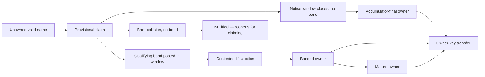

# ONT Launch

> Consolidated 2026-06-11 per doc-canon (#45) from `launch/ONT_LAUNCH_V1_BRIEF.md`, `launch/PRELAUNCH_SCALING_CONFIDENCE_PLAN.md`, `launch/AUCTION_SETTLEMENT_AND_OWNERSHIP.md`, and `launch/ONT_IMPLEMENTATION_AND_VALIDATION.md` (now archived).

This is the review target for ONT v1: what v1 is, what it commits to, what is
actually built, what must still be true before launch, and how v1 stays safe
for later scaling. It follows the current source of truth in
[`ONT.md`](./ONT.md), the canonical status and numbers in
[`core/STATUS.md`](./core/STATUS.md), and the acquisition reference in
[`spec/ONT_ACQUISITION_STATE_MACHINE.md`](./spec/ONT_ACQUISITION_STATE_MACHINE.md).
The normative auction mechanism lives in [`spec/AUCTION.md`](./spec/AUCTION.md)
and [`spec/CONTESTED_AUCTION_REFERENCE.md`](./spec/CONTESTED_AUCTION_REFERENCE.md).

## One-Sentence v1

ONT v1 is a Bitcoin-anchored flat-name system where every valid name enters
through the same public claim path: uncontested claims finalize cheaply through a
batched accumulator, contested claims escalate to a returnable-bond L1 auction,
and all final names are controlled by owner keys.

## What ONT Is For

The narrow first use is human-readable payment names:

> A user can say "pay alice" and clients can resolve `alice` to current
> owner-signed payment instructions.

Bitcoin is used for ownership ordering, scarce allocation, and final settlement.
Mutable payment records stay off-chain and are signed by the current owner key.
Indexers, resolvers, publishers, and wallets make this usable, but do not get to
decide ownership.

## v1 Commitments

ONT v1 commits to:

- one flat namespace
- one neutral entry path for every valid name
- no semantic reserved-name list
- no founder allocation
- no launch-only whitelist or wave
- no token, registrar, rent, or renewal
- a fixed bitcoin claim gate paid to miners
- public notice before uncontested finality
- bonded L1 auction only when a name is contested
- owner-key control for transfers and mutable records
- proof bundles as the portability layer

## Normative Scope

Protocol-critical for v1:

- valid name grammar
- claim anchor and public notice rules
- data-availability rule for batched claims
- contested-name escalation into L1 auction
- auction bid, close, soft-close, and settlement rules
- bond continuity, maturity, and release rules for auction-settled names
- owner-key binding
- transfer rules
- mutable value-record chain format
- portable proof-bundle shape

Explicitly not protocol-critical for v1:

- sponsor credits
- Ark or RGB substrates
- subnames
- discretionary reserved names
- resolver-as-registrar behavior
- a trusted publisher or resolver set

Recovery is present in prototype form. Before launch it should either be frozen
as a clearly specified v1 rule or labeled experimental/deferred. Bonded-name
recovery and UTXO-less accumulator-name recovery should not be conflated.

## Glossary

| Term | Meaning |
| --- | --- |
| Name | A valid flat handle such as `alice`. |
| Owner key | The key that controls transfers and mutable records. |
| Claim gate | The fixed sunk bitcoin fee paid to miners for a claim attempt. |
| Notice window | The public period during which the name can be contested — by posting a bond (→ auction) or nullified by a bare collision. |
| Accumulator | The Bitcoin-anchored Merkle structure that finalizes uncontested claims compactly. |
| Contested | A name a qualifying bond is posted against in the notice window (against a claim, or bond-first); the bond — not a second claim alone — escalates it to auction. two claims with no bond nullify the name instead. |
| Bond | Returnable bitcoin capital used in the L1 auction path. |
| Bond UTXO | The dedicated output backing an immature auction-settled name. |
| Maturity | The point after which owner-key authority can survive bond release. |
| Indexer | Software that watches Bitcoin and reconstructs ONT state. |
| Resolver | User-facing query service backed by indexed state and signed records. |
| Publisher | Service that batches claims and writes anchors; not an authority. |
| Value record | An owner-signed off-chain payment/destination record. |
| Proof bundle | Portable evidence a verifier can use to check ownership. |

## Name Validity

v1 names are deliberately narrow:

```text
[a-z0-9]{1,32}
```

Rules:

- input is case-insensitive
- canonical form is lowercase
- no Unicode
- no punctuation
- no separators
- no whitespace
- no homoglyph policy is needed in v1 because Unicode is not allowed

## State Model



## Acquisition Flow

1. A claimant submits a claim binding a valid name to an owner key.
2. The claim is anchored to Bitcoin and pays the fixed claim gate to miners.
3. The claim is provisional during the notice window.
4. If no qualifying bond is posted against the name in that window (and no bare
   competing claim lands), the claim finalizes through the accumulator.
5. If a qualifying bond is posted in that window — against the claim, or
   bond-first — the name becomes contested and escalates to the bonded L1
   auction path. If a bare competing data-availability-valid claim lands with no bond, the
   name is nullified at window close and reopens for claiming.
6. Whether final by accumulator or auction, the resulting name is controlled by
   the owner key.

If nobody claims a name, the name remains unowned.

## Contested Auction Path

The auction is the escalation path for contested names: bidders submit visible
Bitcoin-backed bids with objective minimum increments, late bids extend a soft
close, the highest valid bonded bidder wins, the winning bid bond becomes the
live name bond, and the owner key in the winning bid controls the name.

The normative mechanism — the real design choices, the working parameter
defaults (all placeholders), and the window schedule — is specified in
[`spec/AUCTION.md`](./spec/AUCTION.md); the deeper rationale reference is
[`spec/CONTESTED_AUCTION_REFERENCE.md`](./spec/CONTESTED_AUCTION_REFERENCE.md).
Current parameter values and their placeholder status are tracked in
[`core/STATUS.md`](./core/STATUS.md), which is the single source of truth.

## Bonds And Maturity

The claim gate and the auction bond are different things.

- The claim gate is sunk and paid to miners.
- The auction bond is returnable bitcoin capital.

For an auction-settled name, the winner's bond is a live commitment during the
immature period. Before maturity, a transfer must move the bond by spending the
current bond outpoint and creating a valid successor bond in the same
transaction.

The current design should freeze one fixed maturity duration before launch. The
older epoch-halving maturity schedule is prototype residue unless deliberately
revived.

After maturity, owner-key authority can survive bond release. Clients may still
display the difference between active-bonded and mature-released ownership.

## Auction Settlement Becomes Ownership

The current experimental settlement shape — the implementation direction, not a
forever-frozen protocol commitment — is:

> the winning bid itself carries the eventual owner key, so we do not need a
> separate settlement transaction just to assign ownership after the auction
> closes.

Each experimental `AUCTION_BID` carries the lot commitment, the observed
pre-bid auction-state commitment, the bidder commitment, the bid amount, the
bond maturity duration, the bond outpoint location, and the eventual
`ownerPubkey`.

When the auction reaches `settled`:

- the highest accepted bid becomes the winner
- the winning bid's `ownerPubkey` becomes the live owner key for the name
- the winning bid bond outpoint becomes the live bond anchor for the name
- the winning bid amount becomes the name's required bond amount
- the name enters bond maturity until the maturity block

In the current experimental engine, the settled auction winner is materialized
as a real `NameRecord` in the registry state. The benefits: fewer transactions
than a separate "win then settle into ownership" step, simpler operator flow
and website explanation, easier indexer materialization, and direct reuse of
the existing name-lock / bond-continuity model — a settled auction becomes a
real owned name without inventing a second ownership-assignment mechanism.

### Bond Continuity Consequences

- the winner bond remains the live bond through the maturity period
- loser bonds become releasable after settlement
- later transfer / invalidation logic can key off the same bond anchor the name
  was created from
- if the winning bond continuity breaks before maturity, the released name can
  be opened again through a new auction generation anchored to the release block

### Released-Name Reauction Path

Names released after an early bond break do not reuse the old auction lot. A
fresh auction generation uses the bond-break release block as its objective
anchor:

- first auction: `opening-{name}` with eligibility block `0`
- reopened auction: `reopen-{name}-after-{release_height}`

The indexer only recognizes a reopened auction if its anchor equals the latest
recorded bond-break release block for that name. This keeps old settled
auctions, malformed reopen attempts, and the next valid auction generation from
collapsing into the same lot commitment.

### Legacy Scheduled-Catalog Compatibility State

The older scheduled-catalog prototype allowed a catalog entry to reach a
configured expiry window without a valid opening bid: it moves to `unopened`,
no auction-owned name is materialized, and the name remains without an owner
unless a current release-anchored or opening-bid path creates a real auction.
That state is useful compatibility coverage for old catalog fixtures, but it is
not the current launch story. In the user-started model, no auction exists
until a valid bonded opening bid confirms. Settlement materialization only
happens for auctions with an actual settled winning bid.

### Settlement Validation

The settlement path is validated beyond the moment of settlement itself. In the
controlled-chain regtest suite, we prove that:

- a settled winning bid materializes into a live owned name
- the winning owner can publish a destination record after settlement
- once bond maturity completes, that auction-owned name can move through a
  mature transfer
- the new owner can then publish the next destination-record sequence
  successfully

That gives a stronger claim than "the winner appears in a feed" — the
auction-owned name is exercised through later registry lifecycle steps too.

### Settlement Questions Still Open

- whether final launch protocol wants a separate winner-acknowledgement step
- exact script and state rules for the split between the live owner bond and a
  possible seller exit bond on pre-maturity transfers
- whether a future version wants a more private winner-key mechanism
- how much of the current experimental derivation should become stricter
  chain-enforced semantics

So the right way to describe the current state is: the repo has an experimental
but real `winning bid -> owned name` settlement path for auctions.

## Transfers

Transfers are ownership events, not resolver updates.

Pre-maturity transfer:

- current owner signs the transfer
- transaction spends the current bond UTXO
- same transaction creates a valid successor bond UTXO
- maturity clock does not reset

Post-maturity transfer:

- current owner signs the transfer
- no successor bond is required
- receiver verifies the transfer against the ownership interval and owner
  signature

Mutable value records do not transfer ownership. They only update what a name
points to.

### Pre-Maturity Transfers: Current Lead Direction

The current experimental engine still models winners using one live owner bond.
That is good enough for current testing, but it may not be the right final
anti-speculation rule for pre-maturity transfers. The strongest current
direction is a split-lock shape, not yet fully implemented:

- a pre-maturity transfer should still deliver a clean asset to the buyer
- the live owner bond for the name should move to the buyer in the transfer
  transaction
- a seller who exits before bond maturity may need to leave behind an exit
  bond until the original maturity block
- the maturity / release clock should not reset on transfer

The intended outcome: clean pre-maturity transfers remain possible, the buyer
does not inherit hidden seller counterparty risk, and short-horizon speculative
flipping remains capital-intensive.

## Value Records

Payment/value records are off-chain and owner-signed. The current shape is:

- name
- owner public key
- ownership reference
- sequence number
- previous record hash
- value type
- payload
- issued timestamp
- owner signature

Resolvers can store and serve these records. A resolver cannot forge a valid
record because the current owner key must sign it.

## Proof Bundles

Proof bundles should become the central reviewer-facing artifact. A bundle
should eventually let a fresh verifier check:

- the acquisition source
- the Bitcoin anchor or auction transcript
- the owner-key chain
- transfers after acquisition
- maturity and bond state when relevant
- the latest owner-signed value-record chain

Verifier code today performs both `verifyProofBundleStructure` (internal
consistency) and `verifyProofBundleAgainstBitcoin` (Merkle inclusion + header
proof-of-work), but producers do not yet *emit* bundles carrying inclusion
proofs, so the light-client path is not closed end-to-end. Until it is, public
language should distinguish "structural bundle verification" from "verified
against Bitcoin headers."

## Implementation And Validation Status

A concrete, honest snapshot of what is actually built, what is prototype, and
what is stubbed — so a reviewer can calibrate the claims. The consensus core,
wire formats, and signatures are real and cross-checked byte-for-byte against a
second (mobile) implementation. The honest distinction a reviewer should hold
is **real-and-on-chain** vs **library/CLI-only** vs **stubbed**.

**Component-level status is canonically tracked in
[`core/STATUS.md`](./core/STATUS.md), which wins over this snapshot if they
disagree.**

| Area | Status | Notes |
| --- | --- | --- |
| Owner-key transfer (gift) | **Built + on-chain (signet)** | Engine-validated; CLI/desktop broadcast to a real chain; mobile signs for real and broadcasts a mature-name transfer end-to-end. |
| Sale / immature-sale transfer | **Library + CLI demo only** | `@ont/architect` builders + `apps/cli` `submit-sale-transfer` / `submit-immature-sale-transfer` commands + tests. **Not** wired into any wallet/web/mobile UI; today it requires manual two-party CLI coordination. |
| Owner-signed value records | **Built + on-chain (signet)** | Sequence-numbered, predecessor-linked, ownership-interval-scoped; resolver ingests/serves; clients verify without trusting the resolver; CLI multi-resolver fan-out/compare. |
| Recovery descriptors | **Built + on-chain (signet)** | Owner-armed, owner-vetoable (recovery, not revocation). The on-chain invoke path is partially specified. |
| Contested auction — on-chain bonded bid | **Built + on-chain (signet)** | Returnable bond output + OP_RETURN bid payload, engine-validated (bond value = bid at `bondVout`); resolver derives auction state from observed `AUCTION_BID` txs; settled winner materializes into an owned name. |
| Cheap ₿1,000 claim — Lightning rail | **Structure wired, payment stubbed** | `apps/publisher` quote → invoice → pay → verify exists, but invoice creation + payment verification are stub / Lexe-sidecar interfaces. v1 is a **pay-first flow with reputable publishers** (pay, then included; a non-payer is left out); atomic payment-on-inclusion binding is a longer-term research item, not a v1 dependency. The wallet does not pay a real Lightning invoice for a claim today. |
| Batched claim path → canonical state | **Live (signet) per STATUS.md** | End-to-end since 2026-06-09: claim → publisher anchors on-chain → indexer decodes the anchor, fetches batch leaves, and re-verifies every membership proof against the Bitcoin-anchored root. **Still open:** availability-marker / fail-closed data-availability deadline enforcement is design + simulation only, and aggregate gate-fee enforcement is not implemented — see STATUS.md "Known-incomplete." |
| Publisher | **Single-writer prototype** | The leaderless multi-publisher convergence design is simulated and tested, not deployed. |
| Mobile wallet | **HD (BIP32), seed-backed** | One seed → a per-name owner key (`m/696969'/0'/i'`) + a funding key (`m/84'/1'/0'/0/0`); seed backup/restore proven on signet; keys in the device keystore. |
| Desktop / CLI wallet | **Single-key** | One owner key + one funding WIF; not HD, no seed recovery (WIF import only). |
| Proof bundle | **Structure + Bitcoin verify** | `verifyProofBundleStructure` + `verifyProofBundleAgainstBitcoin` (Merkle inclusion + header proof-of-work). Producers do not yet *emit* bundles carrying inclusion proofs, so the light-client path is not closed end-to-end. |

### Validated

- Passing unit/package tests across `@ont/protocol`, `@ont/core`, `@ont/cli`,
  `@ont/wallet`, `@ont/web`, `@ont/resolver`; mobile typecheck + offline
  crypto cross-checks that assert byte-identical agreement with the engine.
- Private-signet smoke proving real on-chain `AUCTION_BID`, transfer,
  value-record, and recovery-descriptor activity (not just fixtures).
- The controlled-chain regtest settlement lifecycle proofs listed under
  "Settlement Validation" above.
- See [`operate/TESTING.md`](./operate/TESTING.md).

### Still Open Before Launch (do not imply otherwise)

- Availability-marker / fail-closed data-availability-deadline enforcement on the live cheap
  rail, and aggregate miner-fee enforcement for claim batches (designed, not
  implemented — see STATUS.md).
- A real Lightning payment for the cheap claim (v1 = pay-first with reputable
  publishers; atomic payment-on-inclusion binding is later research, not a v1
  dependency).
- Leaderless multi-publisher deployment + a discovery mechanism.
- Light-client proof bundles emitted end-to-end (Bitcoin-header/inclusion
  verification in produced bundles).
- Final launch notice-window and data-availability-window parameters, bond floors, and
  maturity (placeholders today — see [`core/STATUS.md`](./core/STATUS.md) and
  [`spec/AUCTION.md`](./spec/AUCTION.md)).
- Final recovery scope.
- Batched transfers / batched value-record updates; a polished browser signing
  flow.

## Pre-Launch Scaling Confidence

This section defines what ONT should know before launch so reviewers can
support a simple L1 v1 without feeling that the project is ignoring scale or
painting itself into a corner.

### Position

ONT v1 should not depend on sponsor credits, Ark, RGB, or any custom L2.

But v1 should launch only if:

1. the L1 design stands on its own;
2. v1 data structures do not block future scaling paths;
3. at least one credible scaling path has a concrete lifecycle, proof bundle,
   and threat model;
4. the public launch message is honest about what is solved now versus what is
   being researched.

The goal is not to finish v2 before v1. The goal is to prove that v1 is a sound
base layer for later improvements.

### Core Concern

Some reviewers may hesitate to endorse a pure L1 launch because direct bonded
auctions do not scale to all humans, apps, agents, and devices. That concern is
valid. The investigation behind the current scale hypothesis is recorded in
[`research/archive/SCALABILITY_INVESTIGATION_AND_HYPOTHESES.md`](./research/archive/SCALABILITY_INVESTIGATION_AND_HYPOTHESES.md).

The answer should not be "trust us, scaling later." It should be:

> v1 creates the scarce, strongly verifiable root primitive. The ownership model
> is acquisition-source agnostic, and the leading scale path is public-batch
> sponsored issuance with long notice windows, L1 challenge fallback, and
> portable proof bundles. Ark and RGB are being evaluated as substrates for the
> credit-state and proof layers, not as v1 dependencies.

### Things v1 Must Preserve

1. **Name identity is independent of acquisition path.** `alice` should be the
   same name whether it was acquired by direct L1 bonded auction, future
   sponsored claim, future Ark-backed auction, or future hardened upgrade from
   sponsored to direct. Do not bake "L1 auction txid equals name identity" into
   every layer; treat it as one possible ownership reference.
2. **Owner keys are the stable authority layer.** The owner key should control
   mutable records across every path. Scaling paths should change how ownership
   is acquired or proven, not how users sign records once they own a name.
3. **Proof bundles must be source-tagged.** Clients and resolvers should verify
   proof bundles that declare an acquisition source:
   `bitcoin_l1_direct_auction`, `ark_auction_transcript`,
   `sponsored_public_batch`, `ark_sponsored_claim`,
   `rgb_style_state_transition`. The verifier should not assume every valid
   name comes from the same transcript source forever.
4. **Assurance tiers must be first-class.** Clients should be able to
   distinguish: direct L1 bonded, mature direct released, sponsored final,
   sponsored challenged into auction, Ark-settled, L1 hardened, and
   degraded / unavailable proof data. This avoids future confusion if multiple
   acquisition paths coexist.
5. **Auction rules should be separable from transcript source.** The ONT
   auction state machine should be defined independently from where bids come
   from. v1 transcript source: Bitcoin L1 bid transactions. Future transcript
   sources: Ark/VTXO-collateralized bids, public batch/log bids, other
   proof-bundle-backed sources. The goal is one auction model, not many
   incompatible auction systems.
6. **Public notice is required for optimistic issuance.** For any future
   sponsored/non-UTXO path: sponsor signature creates an intent, public
   batch/log inclusion starts the notice window, full batch data must be
   retrievable, valid challenge routes to auction, and no private or quiet
   claim window can finalize ownership.
7. **Resolver data must be replayable and exportable.** Early ONT can rely
   operationally on one or a few serious resolvers, but only if all data is
   portable. The bootstrap resolver should be a data-availability anchor, not a
   registrar. Initial project operators should commit to multi-year resolver,
   relay, and mirror support while making that support easy to replace:
   publish export and mirror-bootstrap instructions, encourage independent
   operators to run resolvers and relays, support user-configured resolver
   endpoints, make proof bundles portable across services, and keep direct L1
   issuance available when sponsor/relay infrastructure is unavailable.
   Required properties: full event export, full batch export, proof-bundle
   export, deterministic replay, public checkpoint history, easy mirror
   bootstrap.

### Leading Scaling Candidate

The current leading candidate is:

> public-batch sponsor credits, optionally accelerated by Ark, with L1 challenge
> fallback and RGB-style proof discipline.

No-Ark reference path:

1. Sponsor earns credits from mature L1 bonded BTC-time.
2. Sponsor signs `name -> owner_key`.
3. Recipient countersigns.
4. Claim is included in a public resolver/indexer batch.
5. Batch data is mirrored and checkpointed.
6. Long notice window begins from public batch anchor.
7. If challenged by valid L1-backed claim, route to auction.
8. If uncontested, finalize as sponsored.

This is simpler and Bitcoin-native, but credit-state replay and no-challenge
verification put heavy responsibility on indexers/resolvers.

Ark-backed path:

1. Sponsor has Ark/VTXO credit account or capital source.
2. Auction bids or sponsor credit spends happen in Ark-like state.
3. Claims are batched.
4. Batch/transcript data is public and mirrored.
5. Long notice window begins after settled/public batch inclusion.
6. L1 challenge fallback remains available.
7. Final proof bundle distinguishes preconfirmed, settled, sponsored, and
   hardened states.

Ark may improve credit non-reuse, bid collateral, batch execution, and
throughput. Ark should not be required for v1, and preconfirmed Ark state
should not be treated as final ONT ownership without clear assurance labeling.

### Pre-Launch Confidence Gates

**Gate A: v1 extension safety — required before launch.**

- v1 docs explicitly separate name, owner key, ownership reference, and proof
  source
- proof bundles are acquisition-source-tagged
- clients can display assurance tiers
- resolver/indexer events can be replayed without assuming all future ownership
  came from L1 auctions
- launch messaging does not claim L1-only issuance is the final scale answer

**Gate B: sponsor-credit reference design — strongly recommended before
launch.** Can be design-level, not production code.

- exact lifecycle for public-batch sponsored claims
- long notice window rule
- data-availability rule
- L1 challenge fallback rule
- sponsor credit earn/spend/expire rules
- proof bundle sketch for a fresh verifier
- adversarial model covering quiet claims, missing data, duplicate credits, and
  resolver omission

**Gate C: Ark feasibility spike — useful before launch, not a launch blocker.**

- identify which Ark state is independently verifiable
- distinguish preconfirmed vs settled VTXO assurance
- test whether Ark can represent bid collateral or sponsor credit spends
- define what proof artifacts ONT would need from Ark
- confirm Ark does not force ONT to depend on one operator for final ownership

**Gate D: external review packet — recommended before broad launch
amplification.** Ask reviewers narrow questions:

1. Does v1 paint us into a corner for later sponsored/L2 issuance?
2. Does the sponsor-credit reference design avoid hidden registrar trust?
3. Is the public notice plus L1 challenge model credible?
4. Does Ark materially improve credit state or auction execution?
5. Are there simpler alternatives we are missing?

### What To Avoid Before Launch

- promising sponsor credits as solved
- making Ark a v1 dependency
- hard-coding UI language that says all ownership must be L1 bonded forever
- treating Merkle roots as sufficient without batch data availability
- allowing any future claim window to start from private sponsor signature time
- mixing direct bonded and sponsored names without assurance tiers

### Recommended Pre-Launch Work

1. Keep the launch brief's "extension safety" framing current (this section).
2. Define a normative-ish proof-bundle vocabulary for acquisition sources and
   assurance tiers.
3. Write the public-batch sponsored-claim lifecycle as the reference scaling
   candidate.
4. Build a small resolver export/import replay test for proof-bundle data.
5. Do one Ark feasibility spike focused only on bid collateral or credit
   non-reuse.
6. Prepare a short reviewer packet that says exactly what is v1 and what is
   scaling research.

### Public Scaling Summary

ONT v1 is intentionally simple: direct L1 bonded flat names. The scaling plan
is not to abandon that model, but to make it the highest assurance path while
adding cheaper optimistic issuance for long-tail names.

The leading scale path is public-batch sponsor credits:

- many sponsored claims are batched together
- public notice starts only after batch availability
- challengers can force disputed names into the normal auction path
- L1 remains the fallback and hardening layer
- Ark may improve off-chain auction and credit execution
- RGB-style ideas may improve proof bundles and state validation

This gives reviewers a concrete answer:

> v1 does not solve global-scale issuance by itself, but it is designed not to
> block the most credible scaling paths.

## Reviewer Questions

The useful v1 review questions are now narrow:

1. Is the one-path claim -> notice -> final-or-auction model simple enough to
   freeze?
2. Are the claim gate, bond, and maturity parameters separated cleanly enough?
3. Does the data-availability rule let honest indexers converge without trusting a publisher?
4. Does the contested-auction path price scarce names without introducing
   editorial allocation?
5. What exact proof bundle should a user carry to verify ownership without
   trusting a resolver?

Plus the four scaling gates above, with Gate D's five reviewer questions for
the external packet.
