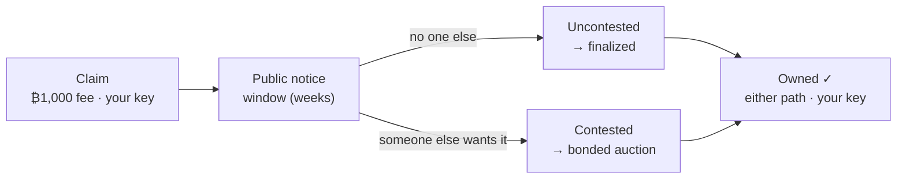

# Open Name Tags (ONT) — one-pager

*A short, human-readable name — like `alice` — that you truly own.*
*Reviewer's version; the deeper level is [`ONT_DESIGN_BRIEF.md`](./ONT_DESIGN_BRIEF.md), and the plain-language source of truth is [`ONT.md`](./ONT.md).*

Most names online are really *accounts*: a company hands them out, and can rename you,
reclaim them, or shut you down. An ONT name is different — it is controlled by a
cryptographic key that only you hold. No company is involved, there is nothing to renew
or pay rent on, there is no token, and no one (not even ONT's authors) can move or revoke
it. Anyone can look up who owns a name and confirm the answer for themselves.

## What you'd use one for

- **A payment handle** — pay `alice` instead of a long address; the name points to wherever
  she wants to be paid.
- **An identity handle** — one username for open-source / decentralized apps and messengers
  that no platform can reassign or revoke.

These are what a sovereign name is *good for* — not a claim that everyone needs one. Adoption
is unproven; the design is what's up for review.

## How you get a name

There is one path for every name. It forks only if two people want the same one.

1. **Claim it.** Pay a small, one-time Bitcoin fee — about $1 (**₿1,000**) — paid to Bitcoin's
   miners, not to ONT.
2. **A public notice window opens** (a few weeks). This is everyone else's chance to *contest*
   the name — if someone else wants it too, that sends it to the auction in step 4 instead of
   finalizing cheaply.
3. **If no one else does, the name is yours.** Thousands of these uncontested claims are bundled
   into one small Bitcoin record — which is what keeps it cheap across billions of names.
4. **If someone else wants it too, the name is *contested*** and goes to
   auction: each bidder locks bitcoin as a **returnable ~one-year bond** (they keep custody;
   it's released at maturity), and the **largest bond wins**.
   Contests can be common early (everyone wants `bitcoin`, popular brands, or dictionary words) but are rare
   across the long tail at scale, so for most names the auction never happens.

If someone else wants the same name during the notice window, it's contested — settled by an
auction, decided by the largest returnable bond. Most names are never contested — they finalize
when the window closes. Either way, you end up with the same thing: a globally unique name
controlled by your key.

**When can you use a contested name?** The moment the auction **settles** — you own it and can
point or transfer it right away. The winning bond simply stays posted through maturity (~1 year),
then returns; that period is about your *capital*, not your ability to use the name. (The bond is a
UTXO you still control — staying "bonded" is an ONT rule, not a Bitcoin timelock: break it before
maturity and you forfeit the name.)

## What owning a name lets you do

A name is controlled by one key — your **owner key**. With it you can:

- **Point the name somewhere** — at a Bitcoin or Lightning address, a website, and so on — and
  change it whenever you like. These mappings live *off-chain*, signed by your key, so updates are
  instant, free, and never touch Bitcoin.
- **Transfer** the name to someone else's key.
- **Optionally set up recovery** so a lost key isn't the end. It's opt-in — skip it and a name is just
  one key you keep safe (like cold-storage bitcoin). Only the backup key you chose can use it, and your
  main key vetoes any misuse within a window you set — a veto you can hand to a non-custodial watcher,
  so a set-and-forget name never needs you online.

## Two services that help — neither decides

Using ONT at scale leans on two **unprivileged** services. Neither owns or decides anything; Bitcoin does.

- **Publisher** — the service you *pay* (over Lightning) to get your claim into Bitcoin. It accepts
  payment, batches thousands of claims into one Merkle commitment, and broadcasts the on-chain anchor.
  *Write-side.*
- **Resolver** — the service you *query* to look up a name. It replays Bitcoin and serves the answer
  (and your owner-signed records), but never decides ownership. *Read-side.*

**What each needs to run.** A publisher needs a Lightning rail, on-chain funds to broadcast anchors,
and batching infrastructure. A resolver needs only a Bitcoin node and storage to replay and serve state.
Both are unprivileged — anyone can run either, and clients *verify* the answers rather than trust them.

The same operator usually runs both, shipped together as one operator stack — but they are **separate at
the protocol layer**: your wallet can claim through publisher A, verify against resolver B, compare
resolvers, or self-host either piece. Bundling is operational convenience, not protocol coupling.

## How it scales

Billions of names can't each be a Bitcoin transaction, so **publishers** batch many claims into one
Merkle commitment and anchor only its root — a ~150-byte root that commits to the whole batch *whatever
its size*, so the more you batch the lower the per-name cost (~**0.015 vB/name** at ten thousand per
batch, less as batches grow). A batch counts only if its miner fee covers the claims inside it, so each
name still buys the blockspace it uses. ONT's on-chain events are single `OP_RETURN` payloads up to ~171 bytes (the recover-owner event; most are smaller).

You pay a publisher off-chain over Lightning; it bundles many claims and pays the single aggregate miner
fee — so the ₿1,000 still reaches **Bitcoin's miners**, even though your immediate payment goes to the
publisher (it's not a fee to the publisher or a resolver). **Your cost is the ₿1,000 gate (sunk, to
miners) plus a thin publisher service fee** — the publisher's own per-name cost is tiny, and any markup
is capped by the always-available option of claiming directly on L1. The flow is **pay-first** (you pay, then you're included; a non-payer is left
out), so the publisher risks no capital — you take a small, bounded one. And a publisher **can't steal a
name**: if it pockets your payment or commits the wrong owner key, you contest on-chain, which forces an
auction the rightful owner wins; worst case you're out about a dollar and re-claim elsewhere. Binding the
payment to inclusion atomically is a possible future refinement, not a v1 dependency. **v1 starts with a
few reputable publishers and minimizes even that small trust over time.**

## Why you can trust it

No company, server, or founder decides who owns a name — Bitcoin does. The rules that turn Bitcoin
transactions into ownership live in a small, **frozen core — three consensus files** that anyone can
audit, locked so its trust surface can't silently grow. Run it
over Bitcoin's history and you get the same answer everyone else does, and you can check that answer
against Bitcoin's own block headers and proof-of-work — so a server that lies about who owns a name
gets caught, not believed. Resolvers only mirror this Bitcoin-derived data; they never decide it.

And no operator is privileged: **anyone can run a resolver or publisher** (see the two roles above).
Because ownership is fixed
by Bitcoin, you don't need a *trusted* node — only a reachable one whose answer you can verify (a
lying node is caught; a slow one is routed around). Finding nodes is config-seeded today; a
registry-free, on-chain discovery scan is designed, not yet built.

## The numbers we're proposing (several are placeholders, all open to challenge)

| Parameter | Proposed | Status |
| --- | --- | --- |
| Claim fee (every name) | **₿1,000** (~$1), sunk, to miners | baseline |
| Contested-auction min bond | **₿50,000** (~$50), returnable | placeholder |
| Bond maturity | ≈52,560 blocks (≈1 yr) | test override |
| Notice window | weeks, height-keyed | placeholder · fairness lever |
| Data-availability windows | unset | deadline for batch bytes to surface + reorg depth |
| On-chain footprint | ~0.015 vB/name; anchor fee = Σ gates | measured |

**Opening bond for scarce short names** — only the very short set (≤4 chars) carries a high
length-scaled opening bond, halving per added character; everything else uses the flat fee plus a
bond only if contested:

| Name length | Opening bond | ~USD |
| --- | --- | --- |
| 1 char | **₿100,000,000** (1 BTC) | ~$100k |
| 2 char | ₿50,000,000 | ~$50k |
| 3 char | ₿25,000,000 | ~$25k |
| 4 char | ₿12,500,000 | ~$12.5k |
| 5+ char | flat fee; ₿50,000 floor if contested | ≈$1 / ≈$50 |

**Least sure of:** the **contest rate** is unknown until launch — we assume it's high early
(everyone wants `bitcoin`, popular brands, or dictionary words) and low for the long tail (`sallysmith2165`); and the
notice window has to be long enough for a competitive early market to form, so premium names aren't
swept cheaply before other bidders show up.

## Status — honest (maturity, not direction)

*Canonical status + numbers: [`core/STATUS.md`](./core/STATUS.md) — the source of truth if anything here drifts.*

**Live on a Bitcoin test network (signet), end-to-end:** claim, owner-key transfer, owner-signed
records, recovery, and a bonded auction bid the resolver accepts — with the consensus code and
signatures cross-checked byte-for-byte against a second independent implementation. **Prototype /
partial:** the cheap batched-claim path is now wired into the live indexer — it observes the anchored
root chain and resolves accumulator-claimed names, re-verifying each against Bitcoin — but the batch-data
*transport* is still a pluggable seam (not a production source) and the resolver/web surface doesn't
expose those names yet; a single-writer publisher; and producers don't yet emit the proofs a
phone/browser would check. Not mainnet-ready.

## What we most want Bitcoin developers to push on

1. **Data availability — including how the batch bytes are transported.** We batch claims and anchor
   only a summary on Bitcoin, leaving the claim data off-chain; our defense if someone withholds it (or
   a reorg reshuffles it) is a deadline — data that isn't public by a set Bitcoin height simply doesn't
   count. Is that sound, and should availability be proven on-chain or by timing alone? And the
   *transport*: we lean toward content-addressed bytes any node can mirror, verified against an on-chain
   digest — so it's **not consensus-critical** and the backend stays swappable. Is publisher-served +
   voluntary mirrors enough censorship-resistance for v1, or is a gossip / DA-sampling layer needed
   sooner? *(Tradeoffs written up in [`design/ONT_DATA_AVAILABILITY_AGREEMENT.md`](./design/ONT_DATA_AVAILABILITY_AGREEMENT.md) §8b.)*
2. **Publisher trust-minimization** — v1 leans on reputable, pay-first publishers (a non-payer is left
   out). Is there a clean, *deployable-today* way to bind "pay the publisher" to "claim anchored
   on-chain" without depending on long-roadmap primitives — or is reputable-publisher trust the right
   v1 stance, with atomic binding left as later research?
3. **Discovery & censorship-resistance** — config-seeded today; is a registry-free, on-chain
   service-announcement scan the right trustless discovery primitive, with Bitcoin + verification as
   the only trust root?
4. **On-chain footprint** — are the ~171-byte `OP_RETURN` events acceptable on mainnet, or is a
   script/covenant carrier worth a soft-fork dependency?
5. **Light-client verification** — a launch blocker, or fine post-launch?
6. **Auction form** — open ascending vs. sealed second-price, given MEV and relay-bid timing?
7. **Launch fairness** — is a long notice window enough against a day-one rush on premium names, or
   do we need a decaying launch fee?
8. **Recovery you can leave unattended** — recovery is opt-in (skip it and a name is just one key, like
   cold-storage bitcoin); if enabled, its challenge-window veto needs *someone* watching, which for a
   set-and-forget name should be a **non-custodial watcher** (can abort, never move the name), not the
   owner. But a literal pre-signed veto can't reference the recovery UTXO (its outpoint isn't known
   until invoke time) — what's the cleanest **name-scoped, abort-only** credential that lets a watcher
   cancel without custody? *(See [`design/ONT_LONG_TAIL_RECOVERY.md`](./design/ONT_LONG_TAIL_RECOVERY.md) §5.6.)*

---

Repo: [github.com/deekay/ont](https://github.com/deekay/ont) · deeper:
[`ONT_DESIGN_BRIEF.md`](./ONT_DESIGN_BRIEF.md) · plain-language source of truth:
[`ONT.md`](./ONT.md).
