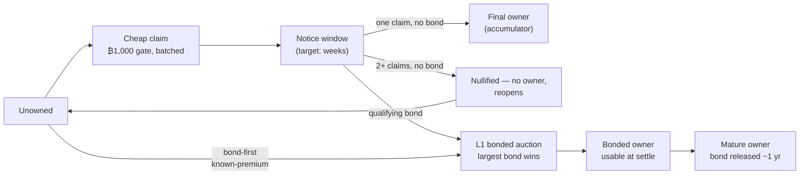

# Open Name Tags (ONT) — one-pager

*A short, human-readable name — like `alice` — settled on Bitcoin, that you actually own.*
*This page leads with the trust model, because that's the first real question. Deeper:
[`ONT_DESIGN_BRIEF.md`](./ONT_DESIGN_BRIEF.md) · plain language: [`ONT.md`](./ONT.md) · canonical
status + numbers: [`core/STATUS.md`](./core/STATUS.md) (it wins if anything here drifts). Amounts
are ₿ where **₿1 = 1 satoshi**; ~$ helpers assume ~$100,000/BTC and drift with the price.*

## The proposal, in three sentences

ONT is a global namespace of names settled on Bitcoin — names are acquired once: a sunk **₿1,000**
(~$1) miner-fee gate for the long tail, batched thousands-per-anchor so it scales; a bonded
on-chain auction when a name is actually contested. After that, one owner key controls the name,
and anyone can re-derive who owns what from Bitcoin plus public batch data — servers get checked,
not believed. Committing so little works because the chain fixes the only things that need global
ordering — who claimed or bonded which name, and by when; everything mutable (what a name *points
to*) is owner-signed off-chain data that needs a signature, not a block.

**The no-list:** no token · no new chain · no governance body or vote · no rent, renewal, or
expiry · no reserved names, founder allocation, or admin key.

## The trust model — who can screw you, and how that's stopped

**What you must trust:**

- **Bitcoin** — for ordering and final settlement. ONT adds no consensus of its own.
- **A small consensus core** — three files (`packages/consensus/src/`: `engine.ts`, `state.ts`,
  `proof-bundle.ts`, over the `@ont/protocol` + `@ont/bitcoin` primitives). A CI test fails the
  build if that boundary grows a file or dependency, so the surface you audit can't silently
  expand. **Honest scope:** today those files determine owner-key authority and replay validation;
  auction *winner-becomes-owner* still sits in indexer code outside the boundary. Decision #42
  moves it inside, gated on demonstrated correctness — until it lands we don't claim the core
  decides auctions.
- **Pre-launch, the project itself** — the rules are *designed to be frozen at launch* and any
  later change is opt-in, but they are **not frozen today**: several parameters are placeholders.
  We say which, below.

**What you explicitly do NOT trust** — each role comes with the mechanism that catches it:

| You don't trust… | …because |
| --- | --- |
| **Publishers** (write-side) | They can't mint ownership: a claim binds *your* owner key, and every batch leaf is re-verified against the Bitcoin-anchored root. Misbehavior is contestable on-chain; loss is bounded at ~$1. |
| **Resolvers** (read-side) | Every answer traces to an anchored root and owner signatures. A lying resolver fails re-verification — caught, not obeyed. (Light-client caveat below.) |
| **The founder** | No admin key, no reserved names, no token, no rent stream; the gate pays miners, not the project. Ownership re-derives from public data; anyone can run the infrastructure. |

## Where the money goes

| You pay | Amount | Who ends up with it | Comes back? |
| --- | --- | --- | --- |
| Claim gate | **₿1,000** (~$1) | **Bitcoin's miners** — the anchor's fee must cover the sum of its per-name gates, so batching can't discount it | No — sunk by design (anti-spam without rent) |
| Publisher service fee | thin markup, **TBD** | the publisher | No — but capped by the standing alternative of claiming directly on L1: charge more than the bypass and you have no customers |
| Auction bond | **₿50,000** floor (~$50), more if outbid | **nobody** — it's your UTXO throughout, posted to maturity | **Yes** — released after ~1 year; the real cost is carry, not the headline |
| Transfer / recovery | normal L1 fees | Bitcoin's miners | No |

There is no protocol revenue, no token to appreciate, and no rent stream — the project has nothing
to extract with. The gate is **fixed in bitcoin, not pegged to a dollar** (a peg would need a
trusted price feed); its ~$ value drifts with the price, and we accept that drift deliberately.

## The attack tour

**"I'll squat everything."** The gate is **sunk, not rent**: ₿1,000 per name to Bitcoin's miners —
~10 BTC (~$1M) per million names, non-refundable, with no rent income and no expiry to flip into
renewal revenue. The valuable head doesn't go cheap anyway: any name someone actually wants can be
bonded into an auction during its notice window, where the **largest returnable bond wins**, and
very short names (≤4 chars) require a mandatory opening bond — **₿100,000,000** (1 BTC, ~$100k) at
1 char, halving per added character. Even there the real cost is carry (~$5,000/yr at 5% on the
1-char bond), since the principal returns. Honest residual: long-tail names nobody contests *can*
be squatted at ₿1,000 each. Squatting isn't impossible; it's priced.

**"I'll front-run your claim."** Ordering can't award a name — not even a miner's. Two bare claims
with no bond **nullify**: the name resolves to no owner and reopens. So front-running buys denial
(₿1,000 sunk, zero payoff), never the name. *Taking* a contested name requires posting the largest
bond — identical cost for a miner and for you — and outcomes are deadline-derived (did a qualifying
bond land by `anchorHeight + W_notice`?), not order-derived. (Decision #37; MEV analysis in
[`design/ONT_MEV_ORDERING_ANALYSIS.md`](./design/ONT_MEV_ORDERING_ANALYSIS.md).)

**"Then I'll grief you with collisions forever."** Each denial round costs the attacker a fresh
sunk ₿1,000. The defender exits the loop **once**: post a qualifying bond, the auction opens, and
the griefer must out-bid with real capital locked ~1 year — or lose the name. The
[attrition model](./research/ONT_NULLIFICATION_ATTRITION_MODEL.md): at a 5%/yr opportunity-cost
assumption, the attacker's sunk spend exceeds the defender's carry at every phase of the window
schedule — **one bond ends the game**. The disclosed asymmetry (Decision #43): no bond floor is
simultaneously cheap for a poor defender and dear for a rich attacker. We accept and document that
rather than paper over it — no sponsorship or proxy-bonding tooling, in v1 or as a protocol
direction. Bonds are bearer BTC, so third-party defense is already permissionless; someone who
needs defense capital arranges a loan *outside* the protocol.

**"The publisher steals my name — or my dollar."** It can't take a name: committing the wrong
owner key (or pocketing your payment) is contestable on-chain, forcing an auction the rightful
owner wins; you re-claim through another publisher or directly on L1. Worst case ≈ ₿1,000 + the
thin service fee, ~$1. The flow is deliberately **pay-first with reputable publishers**
(Decision #38): with ~$1 at risk, atomically binding payment to inclusion is later research, not a
v1 dependency.

**"The resolver lies to me."** Verify-don't-trust: the live indexer re-verifies every batch
membership proof against the on-chain anchored root before serving it, and value records are
owner-signed and sequence-linked, so a resolver can serve them but not invent them. Run the
verifier yourself and you get the same state. **Honest gaps:** the light-client path isn't
closed — the Merkle + proof-of-work verifier exists (tested against a real mainnet block) but
producers don't emit `bitcoinInclusion` proofs yet, so a phone today trusts the resolver it
queries. And auction proof bundles enforce highest-*listed*-bid-wins and a well-formed bid set,
but can't yet prove the set is *complete* against L1 — the same light-client work closes both.

**"The publisher withholds the batch bytes."** The designed rule is **fail-closed**: batch data
not public by a Bitcoin-height-keyed deadline simply doesn't count — withheld claims are excluded
(never awarded), and a hidden claim can't surface later to steal priority. **Honest: this is the
sharpest open item.** The deadline (the W/C/K windows) is design + simulation only; today's live
loop verifies anchors on-chain, fetches and re-verifies the bytes, and retries on gaps — fine for
an honest single publisher on signet, not yet the adversarial story. Bytes are content-addressed
against the anchored digest, so anyone can mirror them and transport is not consensus-critical.
The disclosed loss mode: if *every* copy of a batch vanished, those names couldn't be re-verified —
exactly what the deadline rule plus mirroring must prevent before mainnet.

**"A whale sweeps the launch."** No founder pre-grab, no reserved list, no insider allocation;
claiming opens at a pre-announced height. A cheap sweep of the head runs into the weeks-long
notice window — every swept name is bondable into a public auction for the whole window — and
short names carry the mandatory opening bonds above. We state the open question plainly (risk
register R7): is a long window enough, or does launch need a decaying gate? Capital-rich actors
are most useful as public watchtowers and contest backstops, not allocators.

**"This is OP_RETURN spam."** Issuance amortizes to **~0.015–0.019 vB/name** at ~10k claims per
anchor — one small anchor commits the whole batch. The gate can't be batched away: an anchor
counts only if its miner fee ≥ the sum of per-name gates, so miners receive ₿1,000 × N. Events are
single OP_RETURNs up to ~171 bytes — above the 80-byte default datacarrier policy, relying on
modern node policy (confirmed relaying on signet). Whether that's mainnet-acceptable, or a script
carrier is worth a soft-fork dependency, is an explicit ask.

**"Why not BIP-353 / ENS / Namecoin?"** BIP-353, Lightning Address, and NIP-05 are domain-bound:
lose the DNS name (or the host), lose the handle. ONT carries the same BIP-21/BIP-353-shaped
payment payload and swaps only the *resolution root* — wallet payment code unchanged. ENS charges
rent and is governed by a token DAO that can re-price names; ONT has no rent, no token, no
governance body. Namecoin's first-come-free invited squatting on a separate chain; ONT prices
contention (sunk gate + bonded auctions) and settles on Bitcoin itself.

**"Who runs this, and what's the exit-scam?"** Today: one founder-run publisher + resolver stack
on a private signet; discovery is config-seeded (a registry-free on-chain scan is designed, not
built). Anyone can self-host both from the repo. The exit surface is small by construction: no
token to dump, no rent stream, the gate goes to miners; in-flight exposure is ~$1 per pending
claim at the publisher. If all project infrastructure vanished, final ownership re-derives from
Bitcoin plus the mirrorable batch bytes — subject to the DA caveat above.

## What touches Bitcoin, what doesn't

| Moment | Rail | What happens |
| --- | --- | --- |
| You pay for a claim | Lightning (off-chain) | the ₿1,000 gate, funneled to miners, + the thin publisher fee |
| The batch anchors | **Bitcoin** | one ~73-byte OP_RETURN (`prevRoot → newRoot`) per batch (~10k claims) |
| The notice window passes | nothing | uncontested → finalized and resolvable |
| A contest / a premium name | **Bitcoin** | a bond opens the auction; bids are visible L1 transactions |
| You point the name somewhere | off-chain, free, forever | owner-signed value records; instant, no chain touch |
| You transfer or recover | **Bitcoin** | rare, high-stakes events escalate to L1 |

## The roles, defined by what they cannot do

Ownership never depends on any of these. They are how data moves; Bitcoin plus the replay rules
are how ownership is decided.

| | **Publisher** (write) | **Resolver** (read) | **Watchtower** (recovery veto) |
| --- | --- | --- | --- |
| Does | Accepts paid claims (Lightning), batches ~10k into one Merkle root, anchors it on-chain, serves the batch bytes (`/da/{root}`) | Replays Bitcoin + batch data through the consensus core; serves ownership, owner-signed records, proof bundles | Watches for recovery invokes on names it guards; cancels a malicious one within the challenge window |
| **Cannot** | Mint or move ownership; lock you out of the system (direct L1 self-claim always works) | Decide or invent ownership; forge records | Move, transfer, or point a name — abort-only by construction |
| Worst case | You're out ~₿1,000 (~$1) and re-claim elsewhere | A wasted query — verify, compare resolvers, or self-host | It goes offline and merely adds nothing |
| Running one takes | Bitcoin node, Lightning rail, on-chain funds for anchors; pay-first, so no capital risked on users | Bitcoin node + storage; no Lightning, no funds | Chain watching + a name-scoped abort-only credential |
| Status | Live (signet), single-writer; multi-publisher simulated | Live (signet) | **Designed, not built** — the credential construction is an open problem (a pre-signed veto can't reference a UTXO whose outpoint doesn't exist yet) |

Recovery itself is opt-in: a name with no recovery descriptor is one key, cold-storage style —
nothing to watch. Publisher and resolver are separate at the protocol layer (claim via A, verify
via B, self-host either) even when shipped as one operator stack.

## Lifecycle, compactly

The invariant: a name is acquired only by an uncontested claim that finalizes, or by the winning
bond in an auction. A bare claim can deny, never award — it finalizes or nullifies, and can never
take a contested name. An auction
winner **owns the name at settlement** — points and transfers it immediately; the ~1-year bond
lock is a capital commitment, not a usability gate (break the bond early and you forfeit the
name — bond continuity is an ONT replay rule, not a Bitcoin timelock). Once owned: the owner key
signs transfers (L1), value records (off-chain, free, instant), and optional recovery.

## The numbers (placeholders flagged — they set replay behavior, so they freeze at launch)

| Parameter | Value | Status |
| --- | --- | --- |
| Claim gate, every name | **₿1,000** (~$1), sunk, to miners | baseline |
| Publisher service fee | thin markup over the gate, **TBD** (₿200 in the signet demo is a placeholder, likely too high) | placeholder |
| Auction bond floor | **₿50,000** (~$50), returnable | placeholder — load-bearing (the cost to open a contest, and to defend against one) |
| Bond maturity | ~52,560 blocks (~1 yr) | placeholder / test override |
| Notice window | target **weeks** (test: 6 blocks) | placeholder — the launch-fairness lever |
| Short-name opening bond (≤4 char) | ₿100,000,000 (1 BTC, ~$100k) at 1 char, halving per char; 5+ chars: gate only | baseline |
| DA windows (W/C/K) | unset | open |
| On-chain footprint (issuance) | ~0.015–0.019 vB/name @ ~10k/batch | measured |
| OP_RETURN event size | up to ~171 bytes | measured |

**Least sure of:** the real-world contest rate (we assume high on the obvious head, low across the
long tail), and whether the launch notice window is long enough for a competitive early market to
form — so premium names aren't swept cheaply before other bidders show up.

## Status — honest (signet prototype; not mainnet-ready)

**Live end-to-end on a private signet:** owner-key transfer, owner-signed value records, recovery,
a bonded auction bid the resolver accepts — and, since 2026-06-09, the full cheap rail: a claim at
[claim.opennametags.org](https://claim.opennametags.org) is batched, anchored on-chain,
re-verified by the indexer against the anchored root, and appears in the
[public explorer](https://opennametags.org/explore). One 12-word phrase derives identical keys
across the claim site, web tools, and the mobile app, locked by shared conformance vectors.

**Not live (disclosed):** the fail-closed DA deadline (design + simulation only); the light-client
emit path; multi-publisher (simulated; production is single-writer); real Lightning payment
(stubbed on signet); auction settlement inside the frozen core (decided, gated on demonstrated
correctness). Parameters above are placeholders — the rules are designed to freeze at launch and
are **not frozen today**.

## What we most want pushed on

1. **The DA rule and transport** — is fail-closed-by-height sound against withholding and reorgs?
   Should the availability marker be folded into the anchor itself? Is publisher-served +
   voluntary mirrors enough for v1?
   ([`design/ONT_DATA_AVAILABILITY_AGREEMENT.md`](./design/ONT_DATA_AVAILABILITY_AGREEMENT.md) §8b)
2. **Publisher trust-minimization** — is pay-first + reputable operators the right v1 stance, or
   is there a *deployable-today* way to bind payment to inclusion atomically?
3. **The bond floor** — ₿50,000 is the price of escalation *and* of defense; is there a better
   point on the grief-vs-access curve, given the accepted asymmetry?
4. **The anti-spam sink** — the gate goes to miners as fees; is that the right sink, or does
   anything argue for a provable burn instead?
5. **OP_RETURN footprint** — are ~171-byte events acceptable on mainnet, or is a script/covenant
   carrier worth a soft-fork dependency?
6. **Light-client verification** — launch blocker, or post-launch?
7. **Auction form** — open ascending (current) vs sealed second-price, given MEV and relay-bid
   timing?
8. **Launch fairness** — is a long notice window enough against a day-one sweep, or do we need a
   decaying launch gate?
9. **The watchtower credential** — the cleanest name-scoped, abort-only construction for an
   unattended recovery veto?
   ([`design/ONT_LONG_TAIL_RECOVERY.md`](./design/ONT_LONG_TAIL_RECOVERY.md) §5.6)

---

Repo: [github.com/deekay/ont](https://github.com/deekay/ont) · deeper:
[`ONT_DESIGN_BRIEF.md`](./ONT_DESIGN_BRIEF.md) · exact lifecycle:
[`design/ONT_ACQUISITION_STATE_MACHINE.md`](./design/ONT_ACQUISITION_STATE_MACHINE.md) · plain
language: [`ONT.md`](./ONT.md).
