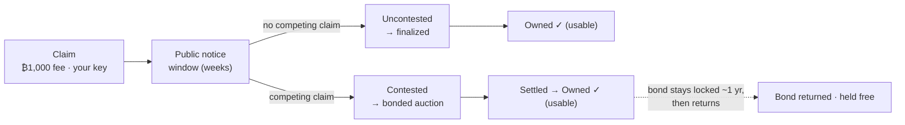

# Open Name Tags (ONT) — one-pager

*A short, human-readable name — like `alice` — that you truly own.*
*Reviewer's version; the deeper level is [`ONT_DESIGN_BRIEF.md`](./ONT_DESIGN_BRIEF.md), and the plain-language source of truth is [`ONT.md`](./ONT.md).*

Most names online are really *accounts*: a company hands them out, and can rename you,
reclaim them, or shut you down. An ONT name is different — it is controlled by a
cryptographic key that only you hold. No company is involved, there is nothing to renew
or pay rent on, there is no token, and no one (not even ONT's authors) can move or revoke
it. Anyone can look up who owns a name and confirm the answer for themselves.

## What you'd use one for

- **A payment handle** — pay `alice` instead of a long address; the name points to wherever
  she wants to be paid.
- **An identity handle** — one username for open-source / decentralized apps and messengers
  that no platform can reassign or revoke.
- **Addressing for services or software agents** *(early)*.

These are what a sovereign name is *good for* — not a claim that everyone needs one. Adoption
is unproven; the design is what's up for review.

## How you get a name

There is one path for every name. It forks only if two people want the same one.

1. **Claim it.** Pay a small, one-time Bitcoin fee — about $1 (**₿1,000**) — paid to Bitcoin's
   miners, not to ONT.
2. **A public notice window opens** (a few weeks). This is everyone else's chance to *contest*
   the name — to put in a competing claim if they want it too. A competing claim doesn't take
   the name; it forces the auction in step 4.
3. **If no one else does, the name is yours.** Thousands of these uncontested claims are bundled
   into one small Bitcoin record — which is what keeps it cheap across billions of names.
4. **If someone else also claims it during the window, the name is *contested*** — and only then
   is it settled by an auction: each bidder locks bitcoin as a **returnable bond** (they keep
   custody; it is released later), and the **largest bond wins** — not whoever claimed first.
   Genuinely contested names are rare, so auctions are the exception.

A second claim *during* the notice window is what makes a name contested; the auction is then
decided by the largest returnable bond. Most names are never contested — they finalize when the
window closes. Either way, you end up with the same thing: a globally unique name controlled by
your key.

**When can you use a contested name?** The moment the auction **settles** — you own it and can
point or transfer it right away. The winning bond simply stays locked through maturity (~1 year),
then returns; that period is about your *capital*, not your ability to use the name.

## What owning a name lets you do

A name is controlled by one key — your **owner key**. With it you can:

- **Point the name somewhere** — at a Bitcoin or Lightning address, a website, and so on — and
  change it whenever you like. These mappings live *off-chain*, signed by your key, so updates are
  instant, free, and never touch Bitcoin.
- **Transfer** the name to someone else's key.
- **Set up recovery** ahead of time, so a lost key isn't the end — and only the backup key you
  chose can use it, so recovery can never become a way for someone to take your name.

## What it costs Bitcoin

Claiming isn't free chain-spam. The fee you pay covers the Bitcoin transaction your claim rides in
— a batch only counts if its miner fee is at least the sum of the claims inside it — so each name
buys the blockspace it uses. And that space is tiny: about **0.016 vB per name** once batched (one
~150-byte anchor carries ~10,000 claims). ONT's on-chain events fit in a ≤135-byte `OP_RETURN`.

## Why you can trust it

No company, server, or founder decides who owns a name — Bitcoin does. The rules that turn Bitcoin
transactions into ownership live in a small, **frozen program (about seven files)** that anyone can
audit; a CI test fails if that core grows a dependency beyond Bitcoin/protocol primitives. Run it
over Bitcoin's history and you get the same answer everyone else does, and you can check that answer
against Bitcoin's own block headers and proof-of-work — so a server that lies about who owns a name
gets caught, not believed. The services that help you find and publish names — *resolvers* — only
mirror this data; they never decide it.

## Privacy

A name's records are a **public directory entry** — everything you map to a name is public and
crawlable. So a name is for the things you *want* public: a payment address (it's *meant* to be
public — that's how you get paid), a website, a verified profile. It is **not** the place for private
contact info (personal email, Signal). For sensitive details you simply don't publish them in any
public name; an obscure second name doesn't help, since all records are crawlable — obscurity is not
privacy. "Private data addressable by a name" would need an **encrypted-records** layer (a payload
encrypted to chosen recipients) — a possible future layer on top of the public directory, not v1.

## The numbers we're proposing (several are placeholders, all open to challenge)

| Parameter | Proposed | Status |
| --- | --- | --- |
| Claim fee (every name) | **₿1,000** (~$1), sunk, to miners | baseline |
| Contested-auction min bond | **₿50,000** (~$50), returnable | placeholder |
| Bond maturity | ~52,560 blocks (~1 yr) | test override |
| Notice window | weeks, height-keyed | placeholder · fairness lever |
| Data-availability windows | unset | deadline for batch bytes to surface + reorg depth |
| On-chain footprint | ~0.016 vB/name; anchor fee = Σ gates | measured |

**Opening bond for scarce short names** — only the very short set (≤4 chars) carries a high
length-scaled opening bond, halving per added character; everything else uses the flat fee plus a
bond only if contested:

| Name length | Opening bond | ~USD |
| --- | --- | --- |
| 1 char | **₿100,000,000** (1 BTC) | ~$100k |
| 2 char | ₿50,000,000 | ~$50k |
| 3 char | ₿25,000,000 | ~$25k |
| 4 char | ₿12,500,000 | ~$12.5k |
| 5+ char | flat fee; ₿50,000 floor if contested | ~$1 / ~$50 |

**Least sure of:** the **contest rate** is unknown until launch — we assume it's high early
(everyone wants `bitcoin`, dictionary words) and low for the long tail (`sallysmith2165`); and the
notice window has to be long enough that real owners can contest a day-one land-rush.

## Status — honest (maturity, not direction)

**Live on a Bitcoin test network (signet), end-to-end:** claim, owner-key transfer, owner-signed
records, recovery, and a bonded auction bid the resolver accepts — with the consensus code and
signatures cross-checked byte-for-byte against a second independent implementation. **Prototype /
not yet wired:** the cheap batched-claim path into the live indexer (built and unit-tested, including
convergence against a data-withholding adversary); a single-writer publisher; and producers don't yet
emit the proofs a phone/browser would check. Not mainnet-ready.

## What we most want Bitcoin developers to push on

1. **Data availability + convergence** — is the fail-closed, height-keyed rule (a batch counts only
   if its bytes surface by a deadline) sound against reorgs and withholding? On-chain availability
   marker, or pure timing?
2. **On-chain footprint** — are the ≤135-byte `OP_RETURN` events acceptable on mainnet, or is a
   script/covenant carrier worth a soft-fork dependency?
3. **Light-client verification** — a launch blocker, or fine post-launch?
4. **Auction form** — open ascending vs. sealed second-price, given MEV and relay-bid timing?
5. **Launch fairness** — is a long notice window enough against a day-one rush on premium names, or
   do we need a decaying launch fee?

---

Repo: [github.com/deekay/ont](https://github.com/deekay/ont) · deeper:
[`ONT_DESIGN_BRIEF.md`](./ONT_DESIGN_BRIEF.md) · plain-language source of truth:
[`ONT.md`](./ONT.md).
