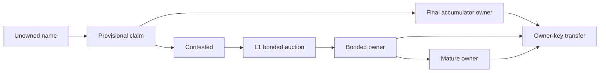

# ONT acquisition state machine

Status: Current reference, 2026-06-01.

This document is the protocol-shape reference for how a name becomes owned. The
plain-language source of truth remains [`../ONT.md`](../ONT.md); this file makes
the acquisition mechanics explicit enough for implementation and review.

## One Path

ONT has one neutral entry path for every valid name:

```text
claim -> public notice -> final owner
                    |
                    v
              contested auction
```

The common case is cheap and batched. The disputed case escalates to a bonded L1
auction. These are not two product lanes; they are two outcomes of the same claim
state machine.

## Valid Names

Names are normalized to lowercase and must match:

```text
[a-z0-9]{1,32}
```

There is no Unicode, punctuation, whitespace, reserved-name list, founder
allocation, launch wave, or subjective premium category in the protocol.

## State Model



## Claim

A claim binds:

- normalized name
- intended owner key
- Bitcoin anchor
- full batch data needed for replay
- fixed per-name gate amount

The gate is a sunk cost paid to Bitcoin miners, not revenue to ONT and not
publisher revenue. The current target is ₿1,000 per name, fixed in bitcoin.

In the batched path, many claims can share one anchor transaction, but the
transaction must still pay enough miner fee to cover the sum of the per-name
gates. Batching saves blockspace; it must not discount the anti-spam gate.

## Public Notice

An anchored claim is provisional. It does not become owned merely because a
publisher issued a receipt.

Finality requires a public notice window, during which the name can be escalated
to auction **by a bond** (see Contested Auction):

- if the window expires with **exactly one cheap claim and no qualifying bond**,
  that claim finalizes through the accumulator
- if the window expires with **two or more cheap claims and no bond**, the name is
  **nullified** — it resolves to *no owner* and reopens for claiming (a bare
  collision can deny, never award)
- if a **qualifying bond** is posted (against an existing claim, or *bond-first*
  with no prior claim), the name escalates to the L1 bonded auction
- claims that arrive after a name is already final are already-owned attempts,
  not contests

The notice window is a protocol parameter to freeze before launch. Test values
may be short; launch values should be chosen for real public contestability.

## Data Availability

A claim only counts if the underlying batch data is available under the protocol's
DA rule. A Merkle root or root anchor is not enough by itself; a verifier needs
the batch bytes to reconstruct state.

The current intended rule is fail-closed:

- data is expected to be available by a Bitcoin-height-keyed deadline
- unavailable or withheld batch data is excluded
- exclusion cannot take someone else's name; it only prevents the withheld data
  from counting
- contested names rely on the hard availability deadline so hidden claims cannot
  appear later and steal priority

See [`ONT_DATA_AVAILABILITY_AGREEMENT.md`](./ONT_DATA_AVAILABILITY_AGREEMENT.md)
for the deeper R1 treatment.

## Contested Auction

A name escalates to the bonded L1 auction when a **qualifying bond** is posted —
either against an existing in-window claim, or **bond-first** with no prior cheap
claim (the natural path for a name you already know is premium, e.g. `bitcoin`).
The escalation trigger is the **bond**, not a bare second claim: a cheap collision
alone can nullify a name (above) but can never open an auction or award the name.

The auction exists for price discovery and anti-griefing when more than one party
actually wants the same name. The intended auction family is:

- open ascending bids
- visible L1 bid transactions
- returnable bid bonds
- soft close near the end of the window
- objective minimum increments
- winner's bond becomes the live name bond

The auction is not a second ordinary acquisition lane. It is opened by a bond, and
the **largest bond wins**. (The ≤4-char length-scaled opening bonds are the
*mandatory* bond-first case of this same mechanism.)

### Bond opens the auction; a bare collision can only nullify

The escalation trigger is a **bond**, not a bare claim. Two consequences:

- A cheap collision (≥2 claims, no bond) **nullifies** the name — it resolves to
  no owner and reopens for claiming. A bare claim can deny, never award.
- Acquiring a contested name requires a **qualifying bond** (largest wins);
  **bond-first** (a bond with no prior cheap claim) is allowed and is the natural
  path for a known-premium name.

This closes the ordering grab (former **R16**) at the root. Front-running a cheap
claim — even a miner ordering its own claim first in a block it mines — buys
*nothing*: worst case it nullifies the name (denial, ₿1,000, no payoff). To *take*
a contested name you lock a real returnable bond — identical cost for a miner and
for everyone else, because the acquisition gate is a **bond**, not a fee-priority
claim. Both outcomes are deadline-derived (a verifier observes, at
`currentHeight ≥ anchorHeight + W_notice`, whether a qualifying bond landed).

Residual: a spite-griefer can still *deny* a targeted name by colliding a cheap
claim (₿1,000, nullify) — no payoff, defendable by the target bonding; unprofitable
and accepted. The ₿50,000 escalation floor (the cost to open/contest an auction) is
now load-bearing — high enough to deter frivolous escalation, low enough not to
block legitimate contests. See
[`ONT_MEV_ORDERING_ANALYSIS.md`](./ONT_MEV_ORDERING_ANALYSIS.md) §D3 and
[`ONT_RISK_REGISTER.md`](./ONT_RISK_REGISTER.md) R16.

## Bonded Ownership

If a name escalates and a bonded auction settles, the winner becomes owner with a
live dedicated bond UTXO.

Before maturity:

- the owner key controls value records and transfer authorization
- the bond must remain continuous
- a transfer must spend the current bond and create a successor bond in the same
  transaction
- a broken bond invalidates active ownership before maturity

After maturity:

- owner-key authority can survive bond release
- mature transfers do not require successor bond continuity
- clients may display the assurance difference between active bonded and mature
  released ownership

The maturity duration should be one fixed protocol parameter before launch. The
older epoch-halving maturity schedule is prototype residue, not the simplest
current model.

## Owner-Key Control

Once a name is final, the owner key is the stable authority layer. It signs:

- transfers
- value records
- optional recovery setup or veto artifacts

The owner-key model should not depend on whether the name came from an
uncontested accumulator claim or a contested L1 auction.

## Value Records

Mutable mappings are off-chain and owner-signed. A resolver can serve them, but
cannot invent them.

Value records are sequence-numbered and predecessor-linked within an ownership
interval, so a client can verify record order and reject stale records from prior
owners.

## Proof Bundles

The goal is that a name owner can carry a portable proof bundle showing:

- the acquisition source
- the Bitcoin anchor or auction transcript
- the current owner key
- any transfer chain after acquisition
- the latest value-record chain

Current proof-bundle code performs structural verification. Full trustless
verification also requires checking Bitcoin transaction inclusion and block
headers. Until that exists, docs and UI should avoid implying that every bundle is
fully Bitcoin-verified offline by the current helper alone.

## Implementation Status

Working today:

- L1 bonded auction prototype and chain-derived auction state
- owner-key transfers
- owner-signed value records
- recovery prototype for immature bonded names
- sparse Merkle accumulator and batch-rail simulations/prototypes
- wallet/publisher cheap-claim prototype path

Not yet canonical end to end:

- resolver/indexer derivation of accumulator-rail ownership
- multi-publisher delta consumption in live resolver state
- enforcement that batched anchors paid the aggregate miner-fee gate
- Bitcoin-header/inclusion verification inside proof bundles
- UTXO-less recovery for accumulator names

## Design Rule

When in doubt, simplify toward this invariant:

> Publishers and resolvers help users publish, store, find, and verify data. They
> never decide who owns a name. Ownership is the deterministic result of Bitcoin
> ordering, ONT validity rules, public notice, and owner-key signatures.
