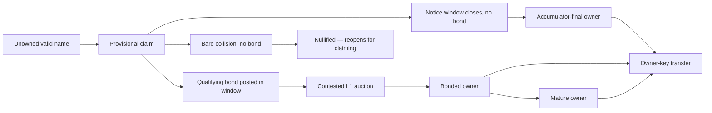

# ONT launch v1 brief

Status: Current launch/review brief, 2026-06-01.

This is the review target for ONT v1. It follows the current source of truth in
[`../ONT.md`](../ONT.md) and the acquisition reference in
[`../design/ONT_ACQUISITION_STATE_MACHINE.md`](../design/ONT_ACQUISITION_STATE_MACHINE.md).

## One-Sentence v1

ONT v1 is a Bitcoin-anchored flat-name system where every valid name enters
through the same public claim path: uncontested claims finalize cheaply through a
batched accumulator, contested claims escalate to a returnable-bond L1 auction,
and all final names are controlled by owner keys.

## What ONT Is For

The narrow first use is human-readable payment names:

> A user can say "pay alice" and clients can resolve `alice` to current
> owner-signed payment instructions.

Bitcoin is used for ownership ordering, scarce allocation, and final settlement.
Mutable payment records stay off-chain and are signed by the current owner key.
Indexers, resolvers, publishers, and wallets make this usable, but do not get to
decide ownership.

## v1 Commitments

ONT v1 commits to:

- one flat namespace
- one neutral entry path for every valid name
- no semantic reserved-name list
- no founder allocation
- no launch-only whitelist or wave
- no token, registrar, rent, or renewal
- a fixed bitcoin claim gate paid to miners
- public notice before uncontested finality
- bonded L1 auction only when a name is contested
- owner-key control for transfers and mutable records
- proof bundles as the portability layer

## Normative Scope

Protocol-critical for v1:

- valid name grammar
- claim anchor and public notice rules
- data-availability rule for batched claims
- contested-name escalation into L1 auction
- auction bid, close, soft-close, and settlement rules
- bond continuity, maturity, and release rules for auction-settled names
- owner-key binding
- transfer rules
- mutable value-record chain format
- portable proof-bundle shape

Explicitly not protocol-critical for v1:

- sponsor credits
- Ark or RGB substrates
- subnames
- discretionary reserved names
- resolver-as-registrar behavior
- a trusted publisher or resolver set

Recovery is present in prototype form. Before launch it should either be frozen
as a clearly specified v1 rule or labeled experimental/deferred. Bonded-name
recovery and UTXO-less accumulator-name recovery should not be conflated.

## Glossary

| Term | Meaning |
| --- | --- |
| Name | A valid flat handle such as `alice`. |
| Owner key | The key that controls transfers and mutable records. |
| Claim gate | The fixed sunk bitcoin fee paid to miners for a claim attempt. |
| Notice window | The public period during which the name can be contested — by posting a bond (→ auction) or nullified by a bare collision. |
| Accumulator | The Bitcoin-anchored Merkle structure that finalizes uncontested claims compactly. |
| Contested | A name a qualifying bond is posted against in the notice window (against a claim, or bond-first); the bond — not a bare second claim — escalates it to auction. Two bare claims with no bond nullify the name instead. |
| Bond | Returnable bitcoin capital used in the L1 auction path. |
| Bond UTXO | The dedicated output backing an immature auction-settled name. |
| Maturity | The point after which owner-key authority can survive bond release. |
| Indexer | Software that watches Bitcoin and reconstructs ONT state. |
| Resolver | User-facing query service backed by indexed state and signed records. |
| Publisher | Service that batches claims and writes anchors; not an authority. |
| Value record | An owner-signed off-chain payment/destination record. |
| Proof bundle | Portable evidence a verifier can use to check ownership. |

## Name Validity

v1 names are deliberately narrow:

```text
[a-z0-9]{1,32}
```

Rules:

- input is case-insensitive
- canonical form is lowercase
- no Unicode
- no punctuation
- no separators
- no whitespace
- no homoglyph policy is needed in v1 because Unicode is not allowed

## State Model



## Acquisition Flow

1. A claimant submits a claim binding a valid name to an owner key.
2. The claim is anchored to Bitcoin and pays the fixed claim gate to miners.
3. The claim is provisional during the notice window.
4. If no competing DA-valid claim lands for the same name in that window, the
   claim finalizes through the accumulator.
5. If a competing DA-valid claim lands for the same name in that window, the name
   becomes contested and escalates to the bonded L1 auction path.
6. Whether final by accumulator or auction, the resulting name is controlled by
   the owner key.

If nobody claims a name, the name remains unowned.

## Contested Auction Flow

The auction path is the escalation for contested names.

1. The contested name enters an L1 auction.
2. Bidders submit visible Bitcoin-backed bids.
3. Bids must satisfy objective minimum increments.
4. Late bids extend the soft close.
5. The highest valid bonded bidder wins.
6. The winning bid bond becomes the live name bond.
7. The owner key in the winning bid controls the name.

Working auction defaults remain review parameters:

| Parameter | Current lean |
| --- | --- |
| auction window | about 7 days |
| soft close extension | about 24 hours |
| normal increment | absolute floor plus percentage increment |
| late increment | stronger than normal increment |
| hard extension cap | not currently favored |

## Bonds And Maturity

The claim gate and the auction bond are different things.

- The claim gate is sunk and paid to miners.
- The auction bond is returnable bitcoin capital.

For an auction-settled name, the winner's bond is a live commitment during the
immature period. Before maturity, a transfer must move the bond by spending the
current bond outpoint and creating a valid successor bond in the same
transaction.

The current design should freeze one fixed maturity duration before launch. The
older epoch-halving maturity schedule is prototype residue unless deliberately
revived.

After maturity, owner-key authority can survive bond release. Clients may still
display the difference between active-bonded and mature-released ownership.

## Transfers

Transfers are ownership events, not resolver updates.

Pre-maturity transfer:

- current owner signs the transfer
- transaction spends the current bond UTXO
- same transaction creates a valid successor bond UTXO
- maturity clock does not reset

Post-maturity transfer:

- current owner signs the transfer
- no successor bond is required
- receiver verifies the transfer against the ownership interval and owner
  signature

Mutable value records do not transfer ownership. They only update what a name
points to.

## Value Records

Payment/value records are off-chain and owner-signed. The current shape is:

- name
- owner public key
- ownership reference
- sequence number
- previous record hash
- value type
- payload
- issued timestamp
- owner signature

Resolvers can store and serve these records. A resolver cannot forge a valid
record because the current owner key must sign it.

## Proof Bundles

Proof bundles should become the central reviewer-facing artifact. A bundle should
eventually let a fresh verifier check:

- the acquisition source
- the Bitcoin anchor or auction transcript
- the owner-key chain
- transfers after acquisition
- maturity and bond state when relevant
- the latest owner-signed value-record chain

Current verifier code performs structural proof-bundle checks. Full
trust-minimized verification also needs Bitcoin inclusion/header verification.
Until that exists, the public language should distinguish "structural bundle
verification" from "verified against Bitcoin headers."

## Implementation Status

Working today:

- L1 bonded auction prototype
- chain-derived auction state
- settled auction winner materialization into owned names
- transfer prototype
- owner-signed value records
- resolver/web/wallet/CLI surfaces
- sparse Merkle accumulator and batch-rail prototypes
- cheap-claim publisher/wallet prototype path

Not yet complete end to end:

- resolver/indexer canonical consumption of accumulator-rail state
- multi-publisher delta ingestion in the live resolver
- aggregate miner-fee enforcement for claim batches
- Bitcoin-header/inclusion verification in proof bundles
- final launch notice-window and DA-window parameters
- final recovery scope

## Reviewer Questions

The useful v1 review questions are now narrow:

1. Is the one-path claim -> notice -> final-or-auction model simple enough to
   freeze?
2. Are the claim gate, bond, and maturity parameters separated cleanly enough?
3. Does the DA rule let honest indexers converge without trusting a publisher?
4. Does the contested-auction path price scarce names without introducing
   editorial allocation?
5. What exact proof bundle should a user carry to verify ownership without
   trusting a resolver?
