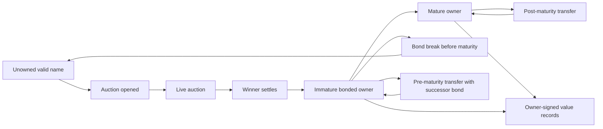
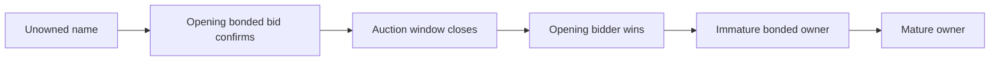
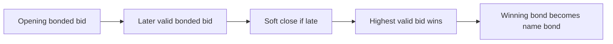
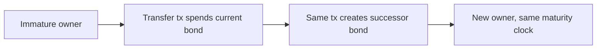
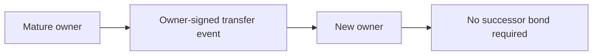

# ONT Launch v1 Brief

This is the review target for ONT v1.

## One-Sentence v1

ONT v1 is a Bitcoin-anchored flat-name system where every valid name is acquired
through the same public bonded auction, ownership is replayable from Bitcoin,
and mutable payment records are signed off-chain by the current owner key.

## What ONT Is For

ONT is for human-readable payment names.

The narrow first use is:

> A user can say "pay alice" and clients can resolve `alice` to current
> owner-signed payment instructions.

The project is not trying to put mutable profile data on Bitcoin. Bitcoin is
used for scarce ownership and transfers. Owner keys sign mutable records.
Indexers and resolvers make those records available.

## v1 Commitments

ONT v1 commits to:

- one flat namespace
- one neutral acquisition rule for every valid name
- no semantic reserved-name list
- no launch-only allocation period
- no ordinary-vs-premium lane
- Bitcoin-bonded public auctions
- owner-signed off-chain payment records
- chain-replayable ownership

Post-launch scaling ideas such as sponsored flat issuance, subnames, resolver
batching, and layer 2 bonding are not part of the v1 consensus design.

## Extension Safety

v1 should be strict, but not brittle.

The launch design should preserve future scaling paths by keeping these concepts
separate:

- name identity
- acquisition source
- ownership reference
- owner key
- mutable value records
- assurance tier

For v1, the only acquisition source is the direct Bitcoin L1 bonded auction. A
future protocol version may add other proof sources, such as public-batch
sponsored claims, Ark-backed auction transcripts, or other verifier-facing
proof bundles.

The owner-key model should remain stable across those paths: once a name is
validly owned, mutable records are signed by the current owner key.

Clients should be able to display assurance differences rather than treating all
owned names as identical. Example future tiers:

- direct L1 bonded
- mature direct released
- sponsored final
- Ark-settled
- L1 hardened
- degraded because proof data is unavailable

This does not put sponsored issuance or Ark into v1. It prevents v1 from
assuming that every future valid ownership proof must look exactly like a v1 L1
auction transcript.

## Normative Scope

This brief is the v1 candidate scope.

Protocol-critical for v1:

- valid name grammar
- auction open, bid, close, and settle rules
- bond continuity, maturity, and release rules
- owner-key binding
- transfer rules
- mutable value-record chain format
- portable proof bundle shape

Non-normative for v1:

- sponsored flat issuance
- subnames
- resolver batching or transparency roots
- layer 2 bonding
- sponsor credits

Recovery is implemented as a prototype direction, but it should be either
frozen explicitly or deferred before any final v1 protocol freeze.

## Glossary

| Term | Meaning |
| --- | --- |
| Name | A valid flat handle such as `alice`. |
| Owner key | The key that controls mutable records and authorizes transfers. |
| Bond | Bitcoin capital committed to acquire and harden a name. |
| Bond UTXO | The dedicated output that backs an immature name. |
| Maturity | The point after which owner-key authority can survive bond release. |
| Indexer | Software that watches Bitcoin and reconstructs ONT ownership state. |
| Resolver | User-facing service that answers name queries using indexed ownership plus signed records. |
| Ownership interval | The period created by an acquisition or transfer event. |
| Value record | An owner-signed off-chain payment/destination record. |
| Recovery | A future owner-key recovery path, not the core v1 acquisition rule. |

## Name Validity

v1 names are deliberately narrow:

```text
[a-z0-9]{1,32}
```

Rules:

- input is case-insensitive
- canonical form is lowercase
- no Unicode
- no punctuation
- no separators
- no whitespace
- no homoglyph policy is needed in v1 because Unicode is not allowed

This is intentionally austere. Richer naming is deferred until the basic
ownership protocol is proven.

## State Model



## Lifecycle Examples

Direct auction with no later competing bid:



Direct auction with multiple bids:



Transfer before maturity:



Transfer after maturity:



## Acquisition Flow

1. A bidder opens an auction with a Bitcoin-bonded bid.
2. The opening transaction identifies the name and the intended owner key.
3. The auction runs for the protocol window, currently expected around 7 days.
4. Later bids must satisfy the minimum increment.
5. Late bids trigger a soft-close extension, currently expected around 24 hours.
6. The highest valid bonded bidder wins.
7. Settlement creates ONT ownership and a dedicated bond UTXO.
8. The owner key can sign payment/value records for the name.

If nobody opens an auction, the name remains unowned.

## Bond And Maturity

The bond is not a fee paid to ONT and not burned bitcoin. It is bitcoin the
winner still owns, but must keep committed during the immature period.

The v1 maturity rule is best understood as an economic anti-spam and commitment
mechanism, not a magic security property. It makes acquisition costly in
capital-time while avoiding annual rent.

Working launch assumption:

- maturity is fixed by pre-announced protocol parameters
- current design lean is about one year
- immature names require live bond continuity
- mature owner-key authority can survive bond release

If owner-key authority survives maturity, the permanent holding cost becomes
low. That is intentional, but reviewers should evaluate whether the initial
capital-time cost and auction competition are enough to prevent harmful capture.

Possible assurance distinction for clients:

- active bonded: live direct bond is still present
- mature released: owner-key authority survives, but no live bond is present

The protocol can treat both as owned, while clients may choose to display the
assurance difference.

## Transfers

Transfers are ownership events, not merely resolver updates.

Pre-maturity transfer:

- current owner signs the transfer
- transaction spends the current bond UTXO
- same transaction creates a valid successor bond UTXO
- maturity clock does not reset

Post-maturity transfer:

- current owner signs the transfer
- no successor bond is required
- receiver verifies the transfer against the ownership interval and owner
  signature

Mutable value records do not transfer ownership. They only update where a name
points.

## Recovery Posture

Recovery is not required to understand the v1 acquisition model.

The current prototype explores BIP322 wallet-proof recovery for immature bonded
names. That path needs crisp rules before launch:

- challenge-window duration
- proof publication before or with recovery broadcast
- proof fanout across resolvers
- late-proof replay behavior
- priority between owner-key cancellation and bond-authorized recovery

If those rules are not frozen, recovery should be described as a post-v1 or
experimental feature rather than a v1 consensus guarantee.

## Mutable Payment Records

Payment/value records are off-chain and owner-signed.

A value record should include:

- name
- owner public key
- ownership interval reference
- sequence number
- previous record hash
- value type
- payload
- owner-issued timestamp
- signature

Indexers derive ownership from Bitcoin. Resolvers verify value records against
the current owner key and ownership interval. A resolver can withhold or lose a
record, but it cannot forge ownership or a valid owner-signed update.

## Indexer And Resolver Boundary

The reviewer should distinguish two roles:

- indexer: reconstructs canonical ownership from Bitcoin
- resolver: serves name lookups and signed off-chain records to users

For v1 portability, a user or resolver should be able to verify ownership from:

- relevant Bitcoin transactions
- ONT event payloads
- bond outpoint continuity before maturity
- owner signatures
- value-record predecessor chain for mutable records

Resolver concentration is still a v1 availability risk for the latest off-chain
records. It is not intended to be an ownership risk.

## Canonical Proof Bundle

The v1 proof bundle is the center of gravity for review. A fresh indexer,
resolver, wallet, or auditor should be able to verify a name without trusting
the resolver that served the bundle.

For a direct auction acquisition, the bundle should contain:

- Bitcoin block headers or trusted chain reference for included transactions
- auction opening transaction and ONT payload
- all accepted bid transactions needed to derive the winner
- auction timing context: open height, close height, soft-close extensions
- winning bid amount and owner-key binding
- winning bond outpoint and required bond amount
- settlement event or rule-derived settlement state

For immature ownership, add:

- current live bond outpoint
- proof that the bond outpoint is unspent at the checked height
- original maturity anchor height
- required maturity height
- any pre-maturity transfer events and successor bond links

For mature ownership after bond release, add:

- proof that maturity was reached before release
- bond-release/spend transaction if the bond was spent
- owner-key continuity from acquisition through any transfers

For transfer history, add:

- owner-signed transfer event
- previous ownership interval reference
- new owner key
- for pre-maturity transfers, successor bond output and amount

For mutable payment/value records, add:

- current ownership interval reference
- latest owner-signed value record
- predecessor chain or explicit completeness metadata
- sequence numbers and previous-record hashes

The proof-bundle format is the practical test for whether resolvers are
availability providers rather than registrars.

## Why Not Existing Systems?

| System | Main difference from ONT |
| --- | --- |
| Namecoin | Earlier Bitcoin-adjacent name system; ONT narrows v1 around payment handles, bonded auctions, owner-key records, and modern wallet/indexer UX. |
| ENS | Strong ecosystem, but depends on Ethereum and rent/contract governance rather than Bitcoin-anchored bonded ownership. |
| Handshake | Strong namespace project, but oriented around DNS/TLD-style ownership rather than Bitcoin payment handles. |
| Pubky / PKARR | Strong self-sovereign key-based routing, but avoids scarce global human-readable names at the base layer. |

ONT is additive only if shared human-readable Bitcoin-anchored names matter.

## Main v1 Attack Questions

| Attack or failure mode | v1 answer |
| --- | --- |
| Fake bids | Bids require real Bitcoin-bonded transactions. |
| Reserved-name disputes | No subjective reserved list; all valid names use the same auction rule. |
| Squatting | Auctions and bond maturity impose capital-time cost, but long-term post-maturity holding is cheap. This is a real tradeoff. |
| Resolver lies about ownership | Clients/indexers can replay Bitcoin ownership events. |
| Resolver withholds latest value record | Availability risk; mitigated later by multi-resolver publish/read and user-held records. |
| Bond break before maturity | Name loses active ownership and can be reopened under protocol rules. |
| Bond release after maturity | Name can remain owned, but clients may display a lower assurance state if no live bond remains. |
| Recovery proof unavailable | Recovery should not finalize unless proof-distribution rules are frozen and verifiable. |
| Homoglyph confusion | Unicode and punctuation are excluded in v1. |

## What Reviewers Should Push On

1. Is the direct bonded auction model coherent enough for v1 launch?
2. Is one-year maturity the right order of magnitude for capital-time cost?
3. Is post-maturity low-cost holding acceptable, or does it invite too much
   squatting?
4. Is the canonical proof bundle complete enough for independent verification?
5. Are transfer and bond-continuity rules independently replayable?
6. Should recovery be frozen into v1 or explicitly deferred?
7. Are resolver availability risks acceptable for v1 if ownership remains
   chain-derived?
