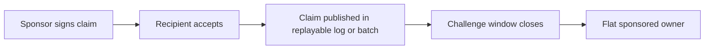
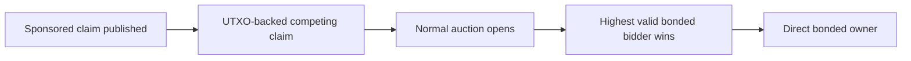

# ONT Scaling Explorations

This document is post-launch design space. It is not the ONT v1 launch spec.

v1 review target: [ONT_LAUNCH_V1_BRIEF.md](./ONT_LAUNCH_V1_BRIEF.md)

Public-notice relay and resolver-transparency details:
[PUBLIC_NOTICE_RELAY_AND_RESOLVER_TRANSPARENCY.md](./PUBLIC_NOTICE_RELAY_AND_RESOLVER_TRANSPARENCY.md)

Scalability investigation, external namespace reference points, and contest-rate
intuition:
[SCALABILITY_INVESTIGATION_AND_HYPOTHESES.md](./SCALABILITY_INVESTIGATION_AND_HYPOTHESES.md)

## Status

Everything in this document is non-normative research unless it is later
promoted into a separate protocol version or launch decision.

The current launch center of gravity is:

> v1 direct bonded flat names plus portable proof bundles.

Sponsored issuance, subnames, batching, resolver transparency, sponsor credits,
and layer 2 bonding should be judged as scaling candidates, not as v1
requirements.

## Scaling Problem

Direct bonded auctions are clean, but they do not obviously scale to every
human, organization, application, and agent.

The direct model creates pressure in four places:

- Bitcoin transactions for auction opens and bids
- temporary bond UTXOs for immature names
- capital-time cost for every user
- resolver availability for off-chain records

If every name requires a Bitcoin transaction and one temporary UTXO, ONT cannot
be the only path for billions of low-value names.

## Design Objective

Find a post-v1 path that preserves as much of this as possible:

- flat human-readable names
- no semantic reserved list
- no trusted registrar
- no burned bitcoin
- ownership portable across resolvers
- Bitcoin used for scarce or disputed names
- ordinary long-tail names cheap enough for mass use

## Exploration A: Sponsored Flat Issuance

Sponsored flat issuance tries to keep the flat namespace without requiring a new
per-name UTXO for every boring name.

It should be treated as an optimistic batch/challenge system, not as informal
sponsor discretion.

Basic idea:

1. v1 direct bonded names mature.
2. Active mature bonds earn sponsor credits from BTC-time.
3. Sponsors spend credits to attempt flat-name issuance.
4. Recipient owner key accepts the issued name.
5. Claim enters a challenge window.
6. If no one posts a UTXO-backed competing claim, the name finalizes.
7. If someone does post a UTXO-backed competing claim, the name goes to the
   normal auction/bond path.

Uncontested means no one else posts the required UTXO-backed competing claim
during the window.

Contested means someone does post the required competing claim, so the name
enters auction.

Normal contests are not sponsor misbehavior. They are market-revealed demand.

## Sponsored Claim Requirements

A sponsored claim still needs a canonical publication path. "No per-name UTXO"
does not mean "no proof."

A viable sponsored claim needs:

- sponsor eligibility proof from mature BTC-time
- recipient owner-key acceptance
- signed claim data for `name -> owner_key`
- canonical publication into a public log, batch, or checkpoint
- deterministic challenge-window start and end
- full data availability for the claim and any batch containing it
- portable inclusion proof for the recipient
- objective result: uncontested finality or escalation into auction

If these are missing, sponsors or resolvers quietly become registrars in
practice.

Sponsored claim, uncontested:



Sponsored claim, challenged into auction:



## Why Sponsored Issuance Might Work

Most names may be long-tail:

- personal variants
- local business names
- device names
- agent names
- app-specific handles
- low-salience words

If most sponsored claims are uncontested, ordinary names can issue with little
or no Bitcoin footprint. Bitcoin remains the path for names that someone else
cares enough to contest.

Throughput scales approximately as:

```text
L1 budget / contest_rate
```

That is the central sensitivity. If 0.1% of sponsored names are contested, the
model can be very scalable. If 10% are contested, it is not a mass-scale path.

## Public Notice And Market Discovery

The most important sponsored-issuance weakness is not speculation by itself.
Speculation after fair public notice is expected market behavior.

The protocol problem is unfair discovery:

> a claim finalizes because challengers did not have a public, monitorable chance
> to see it and respond.

A sponsor signature should create an intent. The challenge window should start
only after the claim is included in a public batch/log with available data.

Required defenses:

- public batch/log inclusion before the notice window starts
- longer notice windows for non-UTXO sponsored names than direct UTXO auctions
- full batch data availability, not just Merkle roots
- easy monitoring tools for challengers
- objective L1-backed challenge path
- proof bundles that show which public batch started the clock

If a name is publicly noticed and still uncontested, that can be a valid market
signal even if the name later becomes valuable. The protocol should prevent
quiet finality, not try to remove all early speculation.

## Sponsored Attempt Caps

Contest-rate throttling is useful as a signal, but it is gameable:

- attackers can contest junk claims to throttle the system
- sponsors can flood safe claims to dilute the observed contest rate

A simpler control may be a deterministic global sponsored-attempt cap per epoch
based on a fixed Bitcoin blockspace budget. Contest rate can still affect
credit pricing or future issuance, but the protocol should not rely only on a
live ratio that attackers can manipulate.

## Sponsor Parameters To Explore

Possible sponsor-credit ingredients:

- one-year maturity before any sponsor credits
- credits accrue per block after maturity
- credits derive from active mature BTC-time
- age multiplier is capped
- credits expire after a fixed period
- sponsor scoring is sublinear above large BTC thresholds
- if sponsor bond is spent, future credits stop
- finalized sponsored names remain valid after sponsor exit

Per-sponsor caps are hard without identity. If sponsor power is based only on
BTC-time, a hard per-identity limit is Sybil-prone. Prefer global caps, credit
expiration, conservative multipliers, sublinear BTC-time scoring, and
transparent sponsor statistics.

Normal contests should probably cost the same credit as clean attempts. A
contest is a market signal, not proof of sponsor abuse.

Invalid sponsor behavior is narrower:

- bad signature
- insufficient credits
- ineligible sponsor bond
- malformed name
- missing recipient acceptance
- conflicting proof
- invalid checkpoint reference

Invalid claims should be rejected or rate-limited. They do not need to be
treated like normal contested names.

## Exploration B: Subnames

Subnames are the cleanest scale path technically.

Example:

- `bitcoin` is directly bonded
- `alice@bitcoin` is issued to Alice's owner key
- the root signs a non-revocable grant
- resolvers verify the root, grant, and Alice's owner-key records

Strengths:

- massive scale
- no per-subname UTXO
- natural organization/community/app namespaces
- Merkle batching works well

Weaknesses:

- subname looks subordinate
- root policy matters
- not identical to direct flat-name sovereignty
- data availability remains necessary

If notation is needed, `alice@bitcoin` may be clearer than `alice.bitcoin`
because dot notation looks like DNS.

## Exploration C: Resolver/Indexer Batching

Indexers and resolvers can help users publish signed intents and proof bundles.

Possible flow:

1. user signs intent
2. user submits to multiple services
3. services gossip and log signed intents
4. a batcher commits a Merkle root to Bitcoin
5. full batch data remains publicly available
6. independent indexers replay deterministic rules

A Merkle root alone is not enough. The full batch data must remain available, or
new resolvers cannot reconstruct state.

This helps with:

- data availability
- checkpointing
- cheaper publication
- censorship evidence
- multi-resolver redundancy

It does not by itself solve:

- who gets included
- fake bids
- bond economics
- withheld data
- canonical ordering if batch data is missing

## Exploration D: Batched Winner Settlement

Batched winner settlement is an L1 optimization where many auction winners
settle in one shared Bitcoin transaction instead of each winner broadcasting a
separate settlement transaction.

Possible flow:

1. multiple auctions close
2. winners provide funding inputs and signatures
3. a coordinator builds one settlement transaction
4. the transaction creates one valid temporary bond output per winning name
5. indexers recognize each winner's output as that name's immature bond

This helps with:

- amortizing transaction overhead across many winners
- reducing fee burden for direct L1 settlement
- coordinating high-assurance root-name settlement
- keeping solo settlement as a fallback while offering a cheaper path

It does not solve:

- bid transaction count
- one temporary bond UTXO per immature name
- user capital lockup
- global-scale issuance

Risks:

- coordinator availability
- stale or double-spent participant inputs
- fee renegotiation if mempool conditions change
- privacy leakage from grouping many ONT settlements
- denial of service from participants who fail to sign
- wallet/PSBT complexity

Design rule:

> Batched settlement should be an optional optimization, not a v1 ownership
> dependency. A winner must always be able to settle alone if batching fails.

Best use:

- future high-assurance direct roots
- auction winners who want lower fees
- service-provider tooling after the basic L1 path is proven

## Exploration E: Layer 2 Bonding

Layer 2 bonding asks:

> Can BTC locked in Lightning, an LSP, a shared UTXO system, or another L2 count
> as ONT bond weight?

For consensus-like ONT use, independent indexers would need to verify:

- amount locked
- controller of the funds
- lock start time
- continuous lock duration
- non-reuse across incompatible claims
- release or penalty rules
- proof validity without trusting one service

Lightning/LSP liquidity is not obviously enough:

- public channel capacity does not prove current balance
- channel state is not globally visible
- private channels are harder
- LSP attestations introduce trust
- hold-invoice mechanisms can tie up liquidity and are bad hygiene at scale

Preliminary stance:

> L2 bonding is future work unless there is a publicly verifiable BTC-time proof
> that independent ONT indexers can check.

Nearer-term L2 uses may still be useful:

- sponsor or resolver collateral
- service payments
- optional serious-bid filtering
- wallet UX
- commercial issuance infrastructure

## Exploration F: Ark / Arkade As Substrate

Ark/Arkade is currently the strongest middle-ground candidate between direct
L1-only ONT and a fully custom ONT L2.

The most promising uses are:

- auction bid collateral and transcript management
- sponsor-credit accounting from VTXO-backed BTC-time
- batch publication of sponsored claims
- possibly later, lower-assurance name ownership states

The preferred sponsor-credit shape is not one VTXO per name. It is:

> one sponsor/bond VTXO or credit account supports many name claims through
> batch-committed off-chain records.

Ark may solve capital/execution compression. It does not remove ONT's need for:

- canonical claim publication
- challenge clocks
- full data availability
- portable proof bundles
- L1 fallback for contested names

See [ARK_RGB_SCALING_NOTES.md](./ARK_RGB_SCALING_NOTES.md).

## Exploration G: RGB Or RGB-Like Client-Side Validation

RGB is worth studying as a proof and validation framework:

- client-side validation
- single-use seals
- off-chain state transitions
- Bitcoin commitments
- schema-defined contract logic
- aggregation of multiple transitions into shared commitments

For ONT, RGB-like ideas may help define proof bundles for sponsored claims,
transfers, and credit transitions. RGB does not by itself solve public name
data availability or auction/challenge visibility. ONT's namespace state is
public by nature, so any RGB-style path needs explicit availability and resolver
replication rules.

See [ARK_RGB_SCALING_NOTES.md](./ARK_RGB_SCALING_NOTES.md).

## Exploration H: Progressive Hardening

Another path is to let names start in a cheaper state and later harden into a
direct Bitcoin-backed state.

Possible states:

1. signed intent observed
2. resolver/indexer logged
3. batch anchored
4. sponsor backed
5. individually bonded
6. mature direct owner

This gives users choice, but introduces multiple assurance levels. Product UX
would need to make those states extremely clear.

## Client Assurance Tiers

Clients may need to show assurance tiers rather than pretending every name has
identical provenance.

Possible labels:

| Tier | Meaning |
| --- | --- |
| Hardened | Direct L1-bonded name with active or mature proof. |
| Released | Mature direct name whose bond has been released; owner-key authority survives. |
| Sponsored | Optimistic flat claim finalized through sponsor/challenge rules. |
| Subname | Root-issued grant under a directly owned name. |

This is a product honesty layer, not necessarily a separate namespace.

## Adversarial Cost Questions

The scaling design should model:

- cost to exploit weak public notice
- cost to force contest rate above throttle thresholds
- cost to censor sponsored claims
- cost to withhold batch data
- cost to produce conflicting resolver views
- cost for sponsors to mass-issue low-quality names
- cost for challengers to grief sponsored issuance
- cost to flood safe claims and dilute contest-rate signals
- cost to accumulate transferable sponsored inventory

The most important missing simulation is not only "how many names per year?"
It is:

> under plausible fee and bond assumptions, what attacks are economically
> attractive?

Sponsored-name transfer should be modeled as a normal owner-key transfer after
issuance finality. A transfer should not reopen the auction or challenge
window. The assurance tier travels with the name: sponsored remains sponsored,
batch-hardened remains batch-hardened, and direct L1 remains direct L1 unless a
separate hardening upgrade occurs.

## Open Questions For Scaling Review

1. Can sponsored flat issuance avoid quiet finality without subjective name
   classification?
2. Should any post-v1 sponsored lane be syntactic, such as length-based, rather
   than universal?
3. What proof bundle makes a sponsored name portable across indexers?
4. Can resolver/indexer batching preserve replayability without creating a
   registrar in practice?
5. Should sponsored attempts be globally capped by epoch instead of relying on
   contest-rate throttles?
6. What proof-bundle and UI requirements make sponsored-name transfers clear
   enough for buyers?
7. Can Ark-backed VTXO state provide enough proof of BTC-time for sponsor
   credits?
8. Can many name claims safely share one sponsor VTXO without making the
   sponsor or Ark operator a registrar?
9. Is RGB useful as an ONT proof/schema framework, or does it add too much
   operational complexity?
10. Is there any real L2 construction that provides publicly verifiable
    BTC-time?
