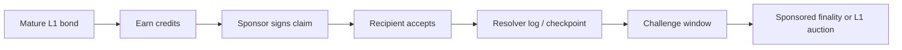
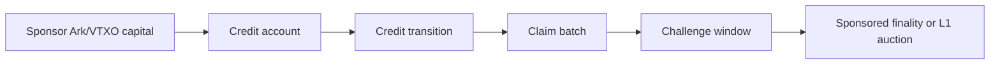
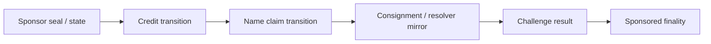

# ONT Sponsor Credits Variants

This document compares concrete sponsor-credit variants against the threat model
in [SPONSOR_CREDITS_THREAT_MODEL.md](./SPONSOR_CREDITS_THREAT_MODEL.md).

It is research for a post-v1 scale path. It is not part of the ONT v1 launch
spec.

## Shared Goal

All variants try to preserve this shape:

1. A sponsor earns issuance capacity from scarce BTC-time.
2. The sponsor spends capacity to publish `name -> owner_key`.
3. The recipient owner key accepts.
4. A challenge window opens.
5. If uncontested, the name finalizes without a per-name L1 UTXO.
6. If contested, the name routes to the standard bonded auction path.

The variants differ in where credit state lives and how a fresh verifier proves
that the claim finalized correctly.

## Variant A: L1-Bonded Sponsor Credits With Resolver Logs

Sponsors earn credits from mature L1 bonded names. Claims are published into
resolver/indexer logs and periodically checkpointed to Bitcoin.

### Lifecycle

### Proof Bundle Needs

- L1 bond proof and maturity proof
- sponsor key binding
- deterministic credit accrual calculation
- credit balance before and after claim
- signed claim and recipient acceptance
- log inclusion proof
- checkpoint inclusion proof
- challenge-window proof
- value-record and transfer chain

### Strengths

- conceptually closest to v1
- no new L2 dependency
- sponsor capital source is ordinary Bitcoin
- easy to explain as "mature names can help issue new names"

### Weaknesses

- credit non-reuse is hard without a canonical state machine
- resolver logs may become de facto registries
- no-challenge proof is hard
- data availability is mostly an indexer/resolver responsibility

### Best Use

Good as the reference model. Weak as a final design unless the resolver log and
credit-state replay story becomes very strong.

## Variant B: Ark-Backed Sponsor Credit Account

Sponsors lock BTC into Ark/VTXO-like state. Sponsor credit accounting happens in
Ark or Ark-like transitions. Many sponsored claims spend credits from one
sponsor account rather than one VTXO per name.

### Lifecycle

### Proof Bundle Needs

- Ark/VTXO capital proof
- proof of BTC-time or eligible locked duration
- credit-account state transition
- non-reuse proof for credit spend
- claim-batch inclusion proof
- data availability proof for batch
- challenge-window proof
- fallback proof if challenged into L1 auction

### Strengths

- better fit for many small claims
- can avoid one VTXO per sponsored name
- may provide cleaner state transitions than resolver logs alone
- pairs naturally with Ark-assisted auctions

### Weaknesses

- depends on Ark/Arkade maturity
- preconfirmed state must not be confused with final protocol state
- VTXO expiry/liveness matters
- operator equivocation and settlement status must be visible
- still needs public data availability

### Best Use

Most promising long-term sponsor-credit substrate, but not ready for v1. This
is the first serious L2 experiment after Ark-assisted auctions.

## Variant C: RGB-Style Client-Side Sponsor State

Sponsor credits and name claims are represented as client-side validated state
transitions. Bitcoin commitments or seal closures anchor state transitions.
Resolvers mirror consignments/proof bundles for public discovery.

### Lifecycle

### Proof Bundle Needs

- schema id
- genesis/credit state
- single-use seal or equivalent non-reuse proof
- sponsor transition chain
- claim transition
- recipient acceptance
- public availability/mirroring proof
- challenge-window proof

### Strengths

- strongest proof discipline
- good model for ownership and transfer chains
- non-reuse can be expressed cleanly if seals map well
- can inspire production proof-bundle schema

### Weaknesses

- public namespace discovery is not native
- data availability may become social
- users/verifiers need full history/consignment
- direct use of RGB may be heavier than ONT needs

### Best Use

Excellent design influence for proof bundles and state transitions. Risky as
the primary issuance layer unless public discovery is solved.

## Variant D: Transferable Sponsored Claims With Assurance Labels

This is the preferred transfer rule that can be combined with A, B, or C:

- sponsored names finalize after public notice and challenge opportunity
- after finality, the owner key can transfer the name
- transfer does not reopen the auction or challenge window
- transfer preserves the existing assurance tier
- direct hardening is a separate optional upgrade path, not a prerequisite for
  sale

### Strengths

- makes sponsored ownership feel like real ownership
- supports later sale if a low-value name becomes valuable
- keeps the challenge window attached to issuance, not every transfer
- avoids making sponsored names feel like revocable licenses

### Weaknesses

- may allow speculative inventory accumulation
- buyers need clear proof-bundle and assurance-tier UX
- marketplaces may need to distinguish sponsored, batch-hardened, and direct L1
  names

### Best Use

Likely the cleanest property-right model if sponsor credits progress. The
protocol should address speculative inventory with public notice, challenge
rights, transparent markets, and assurance labels rather than reopening auctions
on ordinary sale.

## Variant E: Syntactic Eligibility Lane

Only some names can be sponsored. For example:

- short names require direct bonded auction
- long names can use sponsored issuance

This is syntactic, not editorial.

### Strengths

- reduces obvious premium-name squatting
- avoids subjective reserved lists
- keeps direct auction for scarce names

### Weaknesses

- weakens "one universal rule"
- valuable long names still exist
- short/long thresholds become governance-sensitive

### Best Use

Worth modeling, but not obviously desirable. It solves one problem by adding a
protocol boundary users must learn.

## Variant Comparison

| Variant | Scale | Sovereignty | Verifiability | Complexity | Main Risk |
| --- | ---: | ---: | ---: | ---: | --- |
| A. L1 sponsor + resolver logs | Medium-high | Medium | Medium | Medium | resolver log becomes registry |
| B. Ark credit account | High | Medium-high | Medium-high if settled | High | Ark/operator/liveness assumptions |
| C. RGB-style state | High | Medium | High for parties | High | public discovery and DA |
| D. Transferable sponsored claims | N/A | Medium | High | Low-medium | speculative inventory and buyer clarity |
| E. Syntactic eligibility | Medium | High for direct lane | High | Low-medium | threshold politics |

## Current Leaning

The strongest combined candidate is:

> Ark-assisted auctions first, then Ark-backed sponsor credit accounts, with
> RGB-style proof-bundle discipline and explicit assurance labels for
> transferable sponsored names.

This keeps v1 simple and makes each future step test one new assumption:

1. Can Ark handle bid collateral and auction transcripts?
2. Can Ark-backed state prove sponsor credit non-reuse?
3. Can resolvers preserve data availability without becoming registrars?
4. Can sponsored claims avoid quiet finality and hidden registrar trust?

## Narrow Review Prompt

External reviewers should not be asked to bless "sponsor credits" generically.
They should be asked:

> Given Variant B plus transferable sponsored claims, can a fresh verifier prove a
> sponsored name finalized without trusting the sponsor, resolver, or Ark
> operator?

If the answer is no, the next question is whether Variant A or C removes the
specific blocker, or whether sponsor credits should remain deferred.
